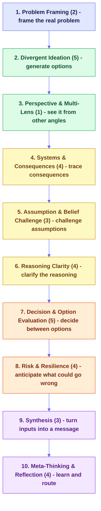
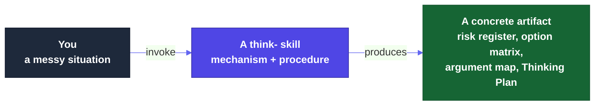

<a id="readme-top"></a>

# Thinking Framework Skills

**An evidence-graded library of agent-executable thinking-method skills.**

Every method is reduced to its working mechanism, graded honestly on how strong its evidence actually is, and shipped as a skill that produces a concrete artifact, not prose.

[**What it is**](#-what-this-is) &nbsp;·&nbsp; [**Install**](#-quick-start) &nbsp;·&nbsp; [**Frameworks**](#-the-catalog) &nbsp;·&nbsp; [**Evidence**](#-the-evidence-model) &nbsp;·&nbsp; [**Recipes**](#-recipes) &nbsp;·&nbsp; [**Live site**](https://product-on-purpose.github.io/thinking-framework-skills/)

<p>
  
  <a href="LICENSE"></a>
  
  <a href="#-conformance-what-advanced-gold-tier-means"></a>
  <a href="#-the-catalog"></a>
  <a href="#-recipes"></a>
  <a href="https://agentskills.io/specification"></a>
  
</p>

---

<details>
<summary><strong>Table of Contents</strong></summary>

- [What this is](#-what-this-is)
- [Quick start](#-quick-start)
- [What makes it different](#-what-makes-it-different)
- [The library at a glance](#-the-library-at-a-glance)
- [The evidence model](#-the-evidence-model)
- [The catalog](#-the-catalog)
- [How a skill works](#-how-a-skill-works)
- [Recipes](#-recipes)
- [Find your way in](#-find-your-way-in)
- [Documentation](#-documentation)
- [Conformance: what advanced (Gold) tier means](#-conformance-what-advanced-gold-tier-means)
- [Project status](#-project-status)
  - [At a glance](#at-a-glance) · [Repo structure](#repo-structure) · [Changelog](#changelog)
- [Contributing](#-contributing)
- [License](#-license)
- [About the maintainer](#-about-the-maintainer)

</details>

---

## 🧠 What this is

AI agents are fluent and fast, and surprisingly weak at the moves that make thinking actually good: reframing a problem before solving the wrong one, separating evidence from inference, imagining how a plan fails before it does, stress-testing a decision from more than one angle. Humans are not much better under time pressure. Both converge too early.

`thinking-framework-skills` packages the durable core of the structured-thinking tradition (decision science, creativity research, systems thinking, foresight, critical thinking) as small, composable, agent-ready skills. Each one helps a person or an agent reframe a problem, generate options, challenge an assumption, trace a consequence, or stress-test a decision, and hands back a usable artifact.

Three things make it different from a list of mental models:

| It is | It is not |
|---|---|
| **Mechanism-first** - the durable cognitive move, named for what it does | A museum of trademarked frameworks |
| **Evidence-graded** - an honest tier (S/M/P/V/A/C/X) on every skill, including "weaker than people think" | A confident claim that every method is "proven" |
| **Artifact-producing** - a risk register, an option matrix, an argument map, a Thinking Plan | A set of vibes-y prompts |
| **Composable** - skills chain into recipes, passing a compressed artifact at each step | A pile of unrelated one-offs |
| **Honest about misuse** - every skill names where it misleads ("when NOT to use this") | A cargo-cult checklist |

**Relationship to [`pm-skills`](https://github.com/product-on-purpose/pm-skills):** sibling library, no technical coupling. `thinking-framework-skills` helps decide *what* to work on and *why* it is sound; `pm-skills` helps execute *how*. They compose; neither depends on the other.

<p align="right">(<a href="#readme-top">back to top</a>)</p>

---

## ⚡ Quick start

**Claude Code (recommended):**

```bash
/plugin marketplace add product-on-purpose/agent-plugins
/plugin install thinking-framework-skills@product-on-purpose
```

All 35 skills become available immediately, invocable by name (for example `/think-premortem`).

**Cross-agent (Cursor, Copilot, Cline, and others via the open [skills CLI](https://github.com/vercel-labs/skills)):**

```bash
npx skills add product-on-purpose/thinking-framework-skills
```

**Clone or download:**

```bash
git clone https://github.com/product-on-purpose/thinking-framework-skills.git
```

**Your first run.** Pick a real decision you are about to commit to, then:

```bash
/think-premortem "we're about to launch a free tier to drive signups"
```

You get a ranked **risk register**: for each top risk, a leading signal, a mitigation, an owner, and a kill criterion. That artifact, not a feeling of caution, is the point. You do not need an agent - every skill is a procedure you can run by hand with the template on its page.

**Not sure which framework you need?** Start with the **[Framework Advisor](https://product-on-purpose.github.io/thinking-framework-skills/frameworks/think-framework-advisor/)**: describe your situation in plain language and it returns a prioritized *Thinking Plan* of which skills to run, in order, and what to skip. It is the front door to everything else.

> 📖 Full walkthrough: [`docs/getting-started.md`](docs/getting-started.md) · Explore the whole library: the [**live site**](https://product-on-purpose.github.io/thinking-framework-skills/).

<p align="right">(<a href="#readme-top">back to top</a>)</p>

---

## 🔬 What makes it different

The field of "thinking methods" has three uneven layers: a small **empirical core** with replicated study evidence, a large **practitioner ring** of long-standing heuristics with real traction but limited formal validation, and a noisy **outer ring** where popularity and weak evidence get conflated. Most libraries flatten all three into one shiny catalog.

This one does the opposite, and that honesty is the product:

- **Grade evidence transparently.** Every skill carries a tier, and its dossier states what the research does and does *not* show. A practitioner-tier method labeled honestly is more trustworthy than one dressed up as science.
- **Do not launder statistics.** The often-cited "premortems surface ~30% more reasons" measures the *number of reasons*, not a 30% gain in decision quality. Claims are scoped to what the studies actually measured.
- **Mechanism over ritual.** The skill implements the durable move and names the branded ritual as lineage, never the reverse. (So the library ships *Parallel Perspectives Review*, not the trademarked Six Thinking Hats.)
- **Flag transferred evidence.** Almost no studies test an *AI agent* running these methods. Where evidence comes from human-subject research, the page says so.

<p align="right">(<a href="#readme-top">back to top</a>)</p>

---

## 🗺️ The library at a glance

35 skills across 10 cognitive-operation families, arranged as a thinking lifecycle. You rarely run all ten; the Framework Advisor picks the few that fit your situation.



*In text: frame the problem, generate options, see it from other angles, trace consequences, challenge assumptions, clarify the reasoning, decide between options, anticipate what could go wrong, synthesize, then reflect.* See the full color-coded map (by evidence tier) on the [live site](https://product-on-purpose.github.io/thinking-framework-skills/explore/map/).

<p align="right">(<a href="#readme-top">back to top</a>)</p>

---

## 🔬 The evidence model

Honest grading is the differentiator, so the key comes **before** the catalog: every skill and every claim is labeled with one of seven tiers, from strongest to weakest.

| Tier | Meaning |
|---|---|
| `S` | **Strong** - replicated experimental or meta-analytic support |
| `M` | **Moderate** - real evidence, but narrower, correlational, or field-based |
| `P` | **Practitioner** - widely used and defensible, without strong controlled evidence |
| `V` | **Vendor** - originates from a consultancy or branded methodology |
| `A` | **Anecdotal** - case reports and testimonials |
| `C` | **Conceptual** - reasonable, not yet demonstrated |
| `X` | **Poor/contradictory** - the evidence cuts against it (excluded, documented) |

A few skills carry a **split grade** (for example `M/P` or `S/M`): the mechanism rests on one tier while a specific claim about it rests on another. Where a grade leans on **human-subject** research that has not been tested on an AI agent, the skill's dossier flags that transfer explicitly rather than overclaiming.

A strong-evidence core anchors the library; everything else is honestly labeled around it. The [bibliography](https://product-on-purpose.github.io/thinking-framework-skills/evidence/bibliography/) aggregates the graded sources so a skeptic can trace any claim to its grounding. See [`docs/concepts.md`](docs/concepts.md) for the short version.

<p align="right">(<a href="#readme-top">back to top</a>)</p>

---

## 📚 The catalog

All 35 skills, by family. The `Tier` column is the [evidence grade](#-the-evidence-model) defined just above. **Each skill name links to its full page** - mechanism, numbered procedure, worked example, and graded sources - on the live site.

### Problem Framing - frame the real problem (2)

| Skill | Tier | What it does |
|---|---|---|
| [**Problem Restatement**](https://product-on-purpose.github.io/thinking-framework-skills/frameworks/think-problem-restatement/) | `M/P` | Rewrite the problem several ways to expose hidden framing, then pick a more useful one |
| [**Abstraction Laddering**](https://product-on-purpose.github.io/thinking-framework-skills/frameworks/think-abstraction-laddering/) | `P` | Move up ("why") and down ("how") the ladder to find the altitude where the problem is workable |

### Divergent Ideation - generate options (5)

| Skill | Tier | What it does |
|---|---|---|
| [**Brainwriting**](https://product-on-purpose.github.io/thinking-framework-skills/frameworks/think-brainwriting/) | `S` | Silent, parallel, written idea generation that reliably outperforms verbal brainstorming |
| [**Far-Analogy Ideation**](https://product-on-purpose.github.io/thinking-framework-skills/frameworks/think-far-analogy-ideation/) | `S` | Transfer solutions from distant domains, which produce more original ideas than near ones |
| [**SCAMPER**](https://product-on-purpose.github.io/thinking-framework-skills/frameworks/think-scamper/) | `P` | Run an idea through seven transformation prompts to force structured variation |
| [**Question Burst**](https://product-on-purpose.github.io/thinking-framework-skills/frameworks/think-question-burst/) | `P` | Generate a rapid burst of questions, rank them, and pursue the most catalytic one |
| [**Assumption Reversal**](https://product-on-purpose.github.io/thinking-framework-skills/frameworks/think-assumption-reversal/) | `P` | Surface the assumptions baked into a problem, negate them, and generate non-obvious reframes |

### Perspective & Multi-Lens - see it from other angles (1)

| Skill | Tier | What it does |
|---|---|---|
| [**Parallel Perspectives Review**](https://product-on-purpose.github.io/thinking-framework-skills/frameworks/think-parallel-perspectives-review/) | `P` | Examine a decision through several separated lenses in turn, then synthesize a balanced read |

### Systems & Consequences - trace consequences (4)

| Skill | Tier | What it does |
|---|---|---|
| [**Stocks and Flows Reasoning**](https://product-on-purpose.github.io/thinking-framework-skills/frameworks/think-stocks-and-flows-reasoning/) | `S` | Reason explicitly about accumulations and rates, which people systematically misjudge |
| [**Causal Loop Diagrams**](https://product-on-purpose.github.io/thinking-framework-skills/frameworks/think-causal-loop-diagrams/) | `M/P` | Close and sign the feedback loops (reinforcing or balancing) to read why a system spirals, settles, or oscillates |
| [**Futures Wheel**](https://product-on-purpose.github.io/thinking-framework-skills/frameworks/think-futures-wheel/) | `P` | Map first-, second-, and third-order consequences radiating from a change |
| [**Iceberg Model**](https://product-on-purpose.github.io/thinking-framework-skills/frameworks/think-iceberg-model/) | `P` | Move from events down to the patterns, structures, and mental models that produce them |

### Assumption & Belief Challenge - challenge assumptions (3)

| Skill | Tier | What it does |
|---|---|---|
| [**Authentic Dissent**](https://product-on-purpose.github.io/thinking-framework-skills/frameworks/think-authentic-dissent/) | `S` | Cultivate genuine minority disagreement, which improves reasoning where role-played dissent does not |
| [**Ladder of Inference Check**](https://product-on-purpose.github.io/thinking-framework-skills/frameworks/think-ladder-of-inference-check/) | `P` | Trace how you climbed from raw data to conclusion to catch where interpretation crept in |
| [**Red Team Light**](https://product-on-purpose.github.io/thinking-framework-skills/frameworks/think-red-team-light/) | `P` | A lightweight adversarial pass that attacks a plan to surface its weak points |

### Reasoning Clarity - clarify the reasoning (4)

| Skill | Tier | What it does |
|---|---|---|
| [**Argument Mapping**](https://product-on-purpose.github.io/thinking-framework-skills/frameworks/think-argument-mapping/) | `S` | Diagram the structure of claims, reasons, and objections to expose where it is weak |
| [**Natural-Frequency Bayesian Framing**](https://product-on-purpose.github.io/thinking-framework-skills/frameworks/think-natural-frequency-bayesian/) | `S` | Express probabilities as natural frequencies (3 in 1,000) to make conditional reasoning tractable |
| [**Evidence vs Inference Sort**](https://product-on-purpose.github.io/thinking-framework-skills/frameworks/think-evidence-vs-inference-sort/) | `P` | Separate what is actually known from what is being inferred, and label each |
| [**Issue Tree**](https://product-on-purpose.github.io/thinking-framework-skills/frameworks/think-issue-tree/) | `P` | Decompose a question into a logical tree of sub-questions to make analysis tractable |

### Decision & Option Evaluation - decide between options (5)

| Skill | Tier | What it does |
|---|---|---|
| [**Linear-Model Aggregation**](https://product-on-purpose.github.io/thinking-framework-skills/frameworks/think-linear-model-aggregation/) | `S` | Score options on a simple weighted model that tends to beat holistic judgment |
| [**Fermi Estimation**](https://product-on-purpose.github.io/thinking-framework-skills/frameworks/think-fermi-estimation/) | `M/P` | Estimate an unknown by decomposing it into order-of-magnitude factors, then multiplying back to a number with a low/high band |
| [**What Would Have to Be True**](https://product-on-purpose.github.io/thinking-framework-skills/frameworks/think-what-would-have-to-be-true/) | `P` | Turn a claim into the specific conditions that must hold, then test them |
| [**Decision Option Review**](https://product-on-purpose.github.io/thinking-framework-skills/frameworks/think-decision-option-review/) | `P` | Compare options against weighted criteria with explicit tradeoffs |
| [**One-Way vs Two-Way Door**](https://product-on-purpose.github.io/thinking-framework-skills/frameworks/think-one-way-vs-two-way-door/) | `P` | Classify a decision by reversibility and match the deliberation cost to it |

### Risk & Resilience - anticipate what could go wrong (4)

| Skill | Tier | What it does |
|---|---|---|
| [**Premortem**](https://product-on-purpose.github.io/thinking-framework-skills/frameworks/think-premortem/) | `S/M` | Imagine the plan has already failed and work backward to causes, tripwires, and kill criteria |
| [**Reference Class Forecasting**](https://product-on-purpose.github.io/thinking-framework-skills/frameworks/think-reference-class-forecasting/) | `S` | Estimate from the track record of similar past projects, not inside-view optimism |
| [**WOOP**](https://product-on-purpose.github.io/thinking-framework-skills/frameworks/think-woop/) | `S` | Wish, Outcome, Obstacle, Plan: mental contrasting plus implementation intentions |
| [**Backcasting**](https://product-on-purpose.github.io/thinking-framework-skills/frameworks/think-backcasting/) | `P` | Start from a desired future state and work backward to the steps to reach it |

### Synthesis - turn inputs into a message (3)

| Skill | Tier | What it does |
|---|---|---|
| [**Concept Mapping**](https://product-on-purpose.github.io/thinking-framework-skills/frameworks/think-concept-mapping/) | `M/P` | Build a labeled-relationship concept network so each link reads as an explicit proposition, surfacing gaps and missing links |
| [**Affinity Mapping**](https://product-on-purpose.github.io/thinking-framework-skills/frameworks/think-affinity-mapping/) | `P` | Cluster many raw notes into emergent themes from the bottom up |
| [**Pyramid Principle**](https://product-on-purpose.github.io/thinking-framework-skills/frameworks/think-pyramid-principle/) | `P` | Structure communication as a governing claim over grouped, ordered support |

### Meta-Thinking & Reflection - learn and route (4)

| Skill | Tier | What it does |
|---|---|---|
| [**After Action Review**](https://product-on-purpose.github.io/thinking-framework-skills/frameworks/think-after-action-review/) | `S` | Structured review of expected vs actual, and what to change, to improve the next loop |
| [**Decision Journal**](https://product-on-purpose.github.io/thinking-framework-skills/frameworks/think-decision-journal/) | `P` | Record the decision, rationale, and prediction now to calibrate your judgment later |
| [**Belief-Update Routine**](https://product-on-purpose.github.io/thinking-framework-skills/frameworks/think-belief-update-routine/) | `P` | Re-score a standing inventory of open beliefs against new evidence on a cadence, with an explicit confidence delta and an under-updating guard |
| [**Framework Advisor**](https://product-on-purpose.github.io/thinking-framework-skills/frameworks/think-framework-advisor/) | `M/C` | The front door: describe a situation, get a prioritized Thinking Plan of which skills to run |

> Browse them five other ways - by job, by evidence, by artifact, by situation, or on the map - in the site's [Explore](https://product-on-purpose.github.io/thinking-framework-skills/explore/) section. The skills themselves live in [`skills/`](skills/).

<p align="right">(<a href="#readme-top">back to top</a>)</p>

---

## ⚙️ How a skill works

Each skill is a self-contained unit: a portable `SKILL.md` (the mechanism and procedure), an `evidence/dossier.md` (the graded sources and honest caveats), a `references/EXAMPLE.md` (a worked example that sets the quality bar), and a `skill.meta.yml` sidecar (governance, taxonomy, relationships).



When you run `/think-premortem "..."`, the agent loads the skill, follows its numbered procedure, mirrors the worked example, and produces the artifact. No prompt engineering required. The docs site is a **generated view** of these files; see [`docs/architecture.md`](docs/architecture.md) for how the skills become the site.

<p align="right">(<a href="#readme-top">back to top</a>)</p>

---

## 🧩 Recipes

Recipes chain several skills into one end-to-end job, passing a compressed artifact at each handoff. Six ship today:

| Recipe | What it does |
|---|---|
| **Reframe a problem** | Restate the problem, sharpen the question, and check the framing before you build |
| **Expand options** | Reframe, then generate genuinely new options before judging any |
| **Stress-test a decision** | Surface what must be true, weigh options, calibrate reversibility, and premortem the plan |
| **Audit reasoning** | Separate evidence from inference, map the argument, and pressure-test it |
| **First principles** | Decompose a problem to its fundamentals, then strip the inherited assumptions to rebuild from what is necessary |
| **Idea-quality audit** | Score a batch of ideas on explicit quality dimensions, then pressure-test the strongest few before committing |

Browse them on the [live site](https://product-on-purpose.github.io/thinking-framework-skills/recipes/) or in [`_workflows/`](_workflows/).

<p align="right">(<a href="#readme-top">back to top</a>)</p>

---

## 🧭 Find your way in

| If you want to... | Start here |
|---|---|
| Get unstuck or decide, now | The [**Framework Advisor**](https://product-on-purpose.github.io/thinking-framework-skills/frameworks/think-framework-advisor/) - describe your situation, get a plan |
| Browse by the job you need done | [Explore by job](https://product-on-purpose.github.io/thinking-framework-skills/explore/by-job/) |
| See only the strong-evidence methods | [Explore by evidence](https://product-on-purpose.github.io/thinking-framework-skills/explore/by-evidence/) |
| Filter by your situation, live | The [interactive chooser](https://product-on-purpose.github.io/thinking-framework-skills/explore/chooser/) |
| Learn good thinking, beginner to advanced | The [learning tracks](https://product-on-purpose.github.io/thinking-framework-skills/learn/) |
| Check the claims | The [evidence and bibliography](https://product-on-purpose.github.io/thinking-framework-skills/evidence/bibliography/) |
| Build with or extend the library | [`docs/`](docs/) and [`docs/contributing.md`](docs/contributing.md) |

<p align="right">(<a href="#readme-top">back to top</a>)</p>

---

## 📖 Documentation

- **[Live site](https://product-on-purpose.github.io/thinking-framework-skills/)** - the full, searchable, interactive experience (per-framework pages, learning tracks, explorers, the bibliography). This is the home for *using* the library.
- **[`docs/`](docs/)** - the repo-browser and contributor layer: [getting started](docs/getting-started.md), [architecture](docs/architecture.md), [concepts](docs/concepts.md), [contributing](docs/contributing.md), [conformance](docs/conformance.md). Plus a `<file>.md` sidecar next to each code/config file.
- **[`skills/`](skills/)** - the frameworks themselves (the source of truth the site renders).

<p align="right">(<a href="#readme-top">back to top</a>)</p>

---

## 🥇 Conformance: what advanced (Gold) tier means

This plugin is built to the [agent-skills-toolkit](https://github.com/product-on-purpose/agent-skills-toolkit) **Advanced Skill Library Standard**, which grades a skill library on three tiers. Each tier includes everything below it:

| Tier | Name | What it certifies |
|---|---|---|
| 🥉 | **Universal (Bronze)** | The skills are portable - valid frontmatter, an `AGENTS.md`, a manifest, references one level deep - so the identical files run on any agentskills.io-compatible agent. |
| 🥈 | **Convergent (Silver)** | The plugin declares its agent targets and emits each higher-order component (commands, workflows, chain contracts) correctly for both Claude Code and Codex, with a manifest that matches what is on disk. |
| 🥇 | **Advanced (Gold)** | The plugin proves itself - it ships CI that runs the Standard's own validators against it and passes (self-hosting), generates its `INDEX.md` and native manifests from a single authored source, and maintains release notes and a deprecation policy. |

`thinking-framework-skills` validates at **advanced (Gold) with 0 errors and 0 warnings** against the pinned toolkit. Concretely, it earns Gold through:

- **G2 - self-hosting CI that passes.** Every pull request runs [`scripts/check.mjs`](scripts/check.mjs) (the Standard's validators) via [`.github/workflows/ci.yml`](.github/workflows/ci.yml), and `check` is a required status check on `main`. The same one command reproduces the result locally.
- **G4 - generated INDEX + manifests.** [`INDEX.md`](INDEX.md), `.claude-plugin/plugin.json`, the Codex manifest, and `manifest.generated.json` are all generated from the authored [`library.json`](library.json) and drift-checked; a hand-edit is a CI error.
- **G5 - release notes.** Curated [`RELEASE-NOTES.md`](RELEASE-NOTES.md), distinct from the technical [`CHANGELOG.md`](CHANGELOG.md).
- **G6 - deprecation policy** and **G7 - all Bronze + Silver requirements**, by inclusion.

Two Gold checks are **not applicable** here, and the library says so rather than papering over it: **G1 (hook documentation)** and **G3 (eval coverage for chains and hooks)** apply only to plugins that ship hooks or chained components. This library ships neither - its recipes are workflow chains of independent skills, not runtime chain contracts - so those checks pass vacuously. Every skill still carries its own `eval/cases.md`.

> Full breakdown, check by check: [`docs/conformance.md`](docs/conformance.md). The Standard itself: [agent-skills-toolkit / STANDARD.md](https://github.com/product-on-purpose/agent-skills-toolkit/blob/main/STANDARD.md).

<p align="right">(<a href="#readme-top">back to top</a>)</p>

---

## 📊 Project status

`v0.2.0` - **public and growing.** The library grows additively, and evidence grades are refreshed as the research does. User-facing highlights live in [`RELEASE-NOTES.md`](RELEASE-NOTES.md); the full technical history is in [`CHANGELOG.md`](CHANGELOG.md).

### At a glance

|  |  |
|---|---|
| **Current version** | [v0.2.0](https://github.com/product-on-purpose/thinking-framework-skills/releases/tag/v0.2.0) |
| **Skills** | 35, across 10 cognitive-operation families |
| **Recipes** | 6 (skill chains shipped as workflow components) |
| **Conformance** | [advanced (Gold)](#-conformance-what-advanced-gold-tier-means) - 0 errors / 0 warnings, self-hosting CI |
| **Evidence** | 11 skills at `S` / `S-M` tier; every skill graded and sourced |
| **Spec** | [agentskills.io](https://agentskills.io/specification) |
| **License** | [Apache-2.0](LICENSE) |
| **Docs site** | [product-on-purpose.github.io/thinking-framework-skills](https://product-on-purpose.github.io/thinking-framework-skills/) |
| **Install** | `/plugin install thinking-framework-skills@product-on-purpose` |

### Repo structure

```
thinking-framework-skills/
├── skills/                  # 35 thinking-method skills (the source of truth)
│   └── think-<method>/      #   SKILL.md, evidence/dossier.md, references/, eval/cases.md, skill.meta.yml
├── _workflows/              # Recipe definitions (multi-skill chains) as workflow components
├── recipes/                 # Human-readable recipe write-ups
├── scripts/                 # gen-site, gen-manifest, gen-recommendable, and the check.mjs gate
├── site/                    # Astro Starlight docs site (a generated view of skills/)
├── docs/                    # Contributor and build docs
│   └── internal/            #   AUTHORING.md, specs/, release-plans/, research/
├── .github/workflows/       # CI: the self-hosting conformance gate + Pages deploy
├── library.json             # Authored manifest (the canonical component index)
├── INDEX.md                 # Generated catalog index (drift-checked)
├── CHANGELOG.md             # Technical version history
├── RELEASE-NOTES.md         # Curated, user-facing release highlights
└── AGENTS.md                # Universal agent-discovery file
```

| Path | What's in it |
|---|---|
| [`skills/`](skills/) | All 35 skills, each a self-contained 5-file unit (the site renders from these) |
| [`_workflows/`](_workflows/) | The 6 recipes as workflow components - ordered skill chains with handoffs |
| [`scripts/`](scripts/) | Generators (site, manifests, name-safety set) and [`check.mjs`](scripts/check.mjs), the conformance gate |
| [`docs/`](docs/) | [Getting started](docs/getting-started.md), [architecture](docs/architecture.md), [concepts](docs/concepts.md), [contributing](docs/contributing.md), [conformance](docs/conformance.md) |
| [`docs/internal/`](docs/internal/) | The [authoring loop](docs/internal/AUTHORING.md), specs, [release plans](docs/internal/release-plans/), and research |

### Changelog

Full detail in [`CHANGELOG.md`](CHANGELOG.md); curated highlights in [`RELEASE-NOTES.md`](RELEASE-NOTES.md).

<details>
<summary><strong>Release history</strong></summary>

| Version | Highlights |
|---|---|
| [**0.2.0**](https://github.com/product-on-purpose/thinking-framework-skills/releases/tag/v0.2.0) | Catalog grows 31 to 34 (Concept Mapping, Causal Loop Diagrams, Fermi Estimation, each vetted against the catalog before authoring) plus a first-principles recipe (4 to 5). A more visual docs site: legible diagrams and beginner concept diagrams on six pages. Gold-tier hardening - a self-hosting conformance gate in CI, a generated `INDEX.md`, and `RELEASE-NOTES.md`. Tier declared `advanced`. |
| [**0.1.0**](https://github.com/product-on-purpose/thinking-framework-skills/releases/tag/v0.1.0) | First public release: 31 evidence-graded, agent-executable skills + 4 composable recipes, validating at convergent (Silver). The `think-framework-advisor` front-door router. A full Astro Starlight docs site (per-framework pages, learning tracks, exploration lenses, interactive chooser, graded bibliography). Listed in the Product on Purpose marketplace. |

</details>

<p align="right">(<a href="#readme-top">back to top</a>)</p>

---

## 🤝 Contributing

Contributions, ideas, and framework proposals are welcome. The bar is deliberately high - it is what keeps the library trustworthy.

**A new framework must clear the selection bar.** It has to:

1. Add a **distinct, durable cognitive move** - not duplicate one already shipped. The overlap ceiling is real: candidates that reduce to an existing skill are rejected or become recipes.
2. Carry an **honest evidence grade** with a dossier of graded sources, including what the research does *not* show.
3. Produce a **concrete artifact**, not prose.
4. State **when *not* to use it.**

**To propose or build one:**

1. Open an issue describing the move and its evidence - the fastest way to get feedback before you build.
2. Read [`docs/contributing.md`](docs/contributing.md) and the per-skill authoring loop in [`docs/internal/AUTHORING.md`](docs/internal/AUTHORING.md).
3. Mirror an existing skill's 5-file structure (`SKILL.md`, `evidence/dossier.md`, `references/`, `eval/cases.md`, `skill.meta.yml`).
4. Run the conformance gate locally (`node scripts/check.mjs`) before opening a PR; CI runs the same gate.

Diagrams follow the pm-skills `utility-mermaid-diagrams` house style. Commit with [Conventional Commits](https://www.conventionalcommits.org/).

<p align="right">(<a href="#readme-top">back to top</a>)</p>

---

## 📄 License

Distributed under the **[Apache License 2.0](LICENSE)**. In short: you may use this library commercially, modify and redistribute it, use it privately, and include it in proprietary software. The only requirements are attribution and including the license notice.

**On method names and trademarks.** Names that are trademarks or carry specific licenses remain the property of their owners. This library implements the underlying cognitive *mechanisms*, names them descriptively, and notes lineage and attribution in each skill's references rather than claiming the brands.

<p align="right">(<a href="#readme-top">back to top</a>)</p>

---

## 👋 About the maintainer

<a href="https://github.com/jprisant"></a>

Built and maintained by **Jonathan Prisant** ([@jprisant](https://github.com/jprisant)), a product leader who thinks in systems and gets unreasonably excited about understanding and solving problems. `thinking-framework-skills` is the reasoning sibling to [`pm-skills`](https://github.com/product-on-purpose/pm-skills): one helps you decide *what* to work on and *why* it is sound, the other helps you execute *how*.

*If this library has sharpened a decision, or saved you from a bad one, consider starring the repo and sharing it with your team.*

<p align="center">
  <strong>Built with purpose by <a href="https://github.com/product-on-purpose">Product on Purpose</a></strong><br>
  <sub>Evidence-graded thinking, packaged as skills your agent can actually run</sub>
</p>

<div align="right"><a href="#readme-top">Back to top ↑</a></div>
