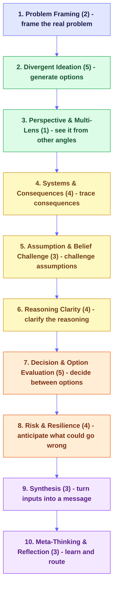
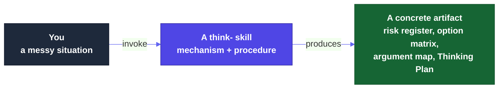

<a id="readme-top"></a>

<div align="center">

# Thinking Framework Skills

**An evidence-graded library of agent-executable thinking-method skills.**

Every method is reduced to its working mechanism, graded honestly on how strong its evidence actually is, and shipped as a skill that produces a concrete artifact, not prose.

<p>
  <a href="#-what-this-is"><strong>What it is</strong></a>
  &nbsp;·&nbsp;
  <a href="#-quick-start"><strong>Install</strong></a>
  &nbsp;·&nbsp;
  <a href="#-the-catalog"><strong>Frameworks</strong></a>
  &nbsp;·&nbsp;
  <a href="#-the-evidence-model"><strong>Evidence</strong></a>
  &nbsp;·&nbsp;
  <a href="#-recipes"><strong>Recipes</strong></a>
  &nbsp;·&nbsp;
  <a href="https://product-on-purpose.github.io/thinking-framework-skills/"><strong>Live site</strong></a>
</p>

<p>
  
  <a href="LICENSE"></a>
  
  <a href="#-the-catalog"></a>
  <a href="#-recipes"></a>
  <a href="https://agentskills.io/specification"></a>
  
</p>

</div>

---

<details>
<summary><strong>Table of Contents</strong></summary>

- [What this is](#-what-this-is)
- [Quick start](#-quick-start)
- [What makes it different](#-what-makes-it-different)
- [The library at a glance](#-the-library-at-a-glance)
- [The catalog](#-the-catalog)
- [The evidence model](#-the-evidence-model)
- [How a skill works](#-how-a-skill-works)
- [Recipes](#-recipes)
- [Find your way in](#-find-your-way-in)
- [Documentation](#-documentation)
- [Project status](#-project-status)
- [Contributing](#-contributing)
- [License and attribution](#-license-and-attribution)
- [Maintainer](#-maintainer)

</details>

---

## 🧠 What this is

AI agents are fluent and fast, and surprisingly weak at the moves that make thinking actually good: reframing a problem before solving the wrong one, separating evidence from inference, imagining how a plan fails before it does, stress-testing a decision from more than one angle. Humans are not much better under time pressure. Both converge too early.

`thinking-framework-skills` packages the durable core of the structured-thinking tradition (decision science, creativity research, systems thinking, foresight, critical thinking) as small, composable, agent-ready skills. Each one helps a person or an agent reframe a problem, generate options, challenge an assumption, trace a consequence, or stress-test a decision, and hands back a usable artifact.

Three things make it different from a list of mental models:

| It is | It is not |
|---|---|
| **Mechanism-first** - the durable cognitive move, named for what it does | A museum of trademarked frameworks |
| **Evidence-graded** - an honest tier (S/M/P/V/A/C/X) on every skill, including "weaker than people think" | A confident claim that every method is "proven" |
| **Artifact-producing** - a risk register, an option matrix, an argument map, a Thinking Plan | A set of vibes-y prompts |
| **Composable** - skills chain into recipes, passing a compressed artifact at each step | A pile of unrelated one-offs |
| **Honest about misuse** - every skill names where it misleads ("when NOT to use this") | A cargo-cult checklist |

**Relationship to [`pm-skills`](https://github.com/product-on-purpose/pm-skills):** sibling library, no technical coupling. `thinking-framework-skills` helps decide *what* to work on and *why* it is sound; `pm-skills` helps execute *how*. They compose; neither depends on the other.

<p align="right">(<a href="#readme-top">back to top</a>)</p>

---

## ⚡ Quick start

**Claude Code (recommended):**

```bash
/plugin marketplace add product-on-purpose/agent-plugins
/plugin install thinking-framework-skills@product-on-purpose
```

All 34 skills become available immediately, invocable by name (for example `/think-premortem`).

**Cross-agent (Cursor, Copilot, Cline, and others via the open [skills CLI](https://github.com/vercel-labs/skills)):**

```bash
npx skills add product-on-purpose/thinking-framework-skills
```

**Clone or download:**

```bash
git clone https://github.com/product-on-purpose/thinking-framework-skills.git
```

**Your first run.** Pick a real decision you are about to commit to, then:

```bash
/think-premortem "we're about to launch a free tier to drive signups"
```

You get a ranked **risk register**: for each top risk, a leading signal, a mitigation, an owner, and a kill criterion. That artifact, not a feeling of caution, is the point. You do not need an agent - every skill is a procedure you can run by hand with the template on its page.

**Not sure which framework you need?** Start with the **[Framework Advisor](https://product-on-purpose.github.io/thinking-framework-skills/frameworks/think-framework-advisor/)**: describe your situation in plain language and it returns a prioritized *Thinking Plan* of which skills to run, in order, and what to skip. It is the front door to everything else.

> 📖 Full walkthrough: [`docs/getting-started.md`](docs/getting-started.md) · Explore the whole library: the [**live site**](https://product-on-purpose.github.io/thinking-framework-skills/).

<p align="right">(<a href="#readme-top">back to top</a>)</p>

---

## 🔬 What makes it different

The field of "thinking methods" has three uneven layers: a small **empirical core** with replicated study evidence, a large **practitioner ring** of long-standing heuristics with real traction but limited formal validation, and a noisy **outer ring** where popularity and weak evidence get conflated. Most libraries flatten all three into one shiny catalog.

This one does the opposite, and that honesty is the product:

- **Grade evidence transparently.** Every skill carries a tier, and its dossier states what the research does and does *not* show. A practitioner-tier method labeled honestly is more trustworthy than one dressed up as science.
- **Do not launder statistics.** The often-cited "premortems surface ~30% more reasons" measures the *number of reasons*, not a 30% gain in decision quality. Claims are scoped to what the studies actually measured.
- **Mechanism over ritual.** The skill implements the durable move and names the branded ritual as lineage, never the reverse. (So the library ships *Parallel Perspectives Review*, not the trademarked Six Thinking Hats.)
- **Flag transferred evidence.** Almost no studies test an *AI agent* running these methods. Where evidence comes from human-subject research, the page says so.

<p align="right">(<a href="#readme-top">back to top</a>)</p>

---

## 🗺️ The library at a glance

34 skills across 10 cognitive-operation families, arranged as a thinking lifecycle. You rarely run all ten; the Framework Advisor picks the few that fit your situation.



*In text: frame the problem, generate options, see it from other angles, trace consequences, challenge assumptions, clarify the reasoning, decide between options, anticipate what could go wrong, synthesize, then reflect.* See the full color-coded map (by evidence tier) on the [live site](https://product-on-purpose.github.io/thinking-framework-skills/explore/map/).

<p align="right">(<a href="#readme-top">back to top</a>)</p>

---

## 📚 The catalog

All 34 skills, by family. The tier is the evidence grade (see [the evidence model](#-the-evidence-model)). Each links to its full page (mechanism, procedure, worked example, graded sources) on the live site.

### Problem Framing - frame the real problem (2)

| Skill | Tier | What it does |
|---|---|---|
| **Problem Restatement** | `M/P` | Rewrite the problem several ways to expose hidden framing, then pick a more useful one |
| **Abstraction Laddering** | `P` | Move up ("why") and down ("how") the ladder to find the altitude where the problem is workable |

### Divergent Ideation - generate options (5)

| Skill | Tier | What it does |
|---|---|---|
| **Brainwriting** | `S` | Silent, parallel, written idea generation that reliably outperforms verbal brainstorming |
| **Far-Analogy Ideation** | `S` | Transfer solutions from distant domains, which produce more original ideas than near ones |
| **SCAMPER** | `P` | Run an idea through seven transformation prompts to force structured variation |
| **Question Burst** | `P` | Generate a rapid burst of questions, rank them, and pursue the most catalytic one |
| **Assumption Reversal** | `P` | Surface the assumptions baked into a problem, negate them, and generate non-obvious reframes |

### Perspective & Multi-Lens - see it from other angles (1)

| Skill | Tier | What it does |
|---|---|---|
| **Parallel Perspectives Review** | `P` | Examine a decision through several separated lenses in turn, then synthesize a balanced read |

### Systems & Consequences - trace consequences (4)

| Skill | Tier | What it does |
|---|---|---|
| **Stocks and Flows Reasoning** | `S` | Reason explicitly about accumulations and rates, which people systematically misjudge |
| **Causal Loop Diagrams** | `M/P` | Close and sign the feedback loops (reinforcing or balancing) to read why a system spirals, settles, or oscillates |
| **Futures Wheel** | `P` | Map first-, second-, and third-order consequences radiating from a change |
| **Iceberg Model** | `P` | Move from events down to the patterns, structures, and mental models that produce them |

### Assumption & Belief Challenge - challenge assumptions (3)

| Skill | Tier | What it does |
|---|---|---|
| **Authentic Dissent** | `S` | Cultivate genuine minority disagreement, which improves reasoning where role-played dissent does not |
| **Ladder of Inference Check** | `P` | Trace how you climbed from raw data to conclusion to catch where interpretation crept in |
| **Red Team Light** | `P` | A lightweight adversarial pass that attacks a plan to surface its weak points |

### Reasoning Clarity - clarify the reasoning (4)

| Skill | Tier | What it does |
|---|---|---|
| **Argument Mapping** | `S` | Diagram the structure of claims, reasons, and objections to expose where it is weak |
| **Natural-Frequency Bayesian Framing** | `S` | Express probabilities as natural frequencies (3 in 1,000) to make conditional reasoning tractable |
| **Evidence vs Inference Sort** | `P` | Separate what is actually known from what is being inferred, and label each |
| **Issue Tree** | `P` | Decompose a question into a logical tree of sub-questions to make analysis tractable |

### Decision & Option Evaluation - decide between options (5)

| Skill | Tier | What it does |
|---|---|---|
| **Linear-Model Aggregation** | `S` | Score options on a simple weighted model that tends to beat holistic judgment |
| **Fermi Estimation** | `M/P` | Estimate an unknown by decomposing it into order-of-magnitude factors, then multiplying back to a number with a low/high band |
| **What Would Have to Be True** | `P` | Turn a claim into the specific conditions that must hold, then test them |
| **Decision Option Review** | `P` | Compare options against weighted criteria with explicit tradeoffs |
| **One-Way vs Two-Way Door** | `P` | Classify a decision by reversibility and match the deliberation cost to it |

### Risk & Resilience - anticipate what could go wrong (4)

| Skill | Tier | What it does |
|---|---|---|
| **Premortem** | `S/M` | Imagine the plan has already failed and work backward to causes, tripwires, and kill criteria |
| **Reference Class Forecasting** | `S` | Estimate from the track record of similar past projects, not inside-view optimism |
| **WOOP** | `S` | Wish, Outcome, Obstacle, Plan: mental contrasting plus implementation intentions |
| **Backcasting** | `P` | Start from a desired future state and work backward to the steps to reach it |

### Synthesis - turn inputs into a message (3)

| Skill | Tier | What it does |
|---|---|---|
| **Concept Mapping** | `M/P` | Build a labeled-relationship concept network so each link reads as an explicit proposition, surfacing gaps and missing links |
| **Affinity Mapping** | `P` | Cluster many raw notes into emergent themes from the bottom up |
| **Pyramid Principle** | `P` | Structure communication as a governing claim over grouped, ordered support |

### Meta-Thinking & Reflection - learn and route (3)

| Skill | Tier | What it does |
|---|---|---|
| **After Action Review** | `S` | Structured review of expected vs actual, and what to change, to improve the next loop |
| **Decision Journal** | `P` | Record the decision, rationale, and prediction now to calibrate your judgment later |
| **Framework Advisor** | `M/C` | The front door: describe a situation, get a prioritized Thinking Plan of which skills to run |

> Browse them five other ways - by job, by evidence, by artifact, by situation, or on the map - in the site's [Explore](https://product-on-purpose.github.io/thinking-framework-skills/explore/) section. The skills themselves live in [`skills/`](skills/).

<p align="right">(<a href="#readme-top">back to top</a>)</p>

---

## 🔬 The evidence model

Honest grading is the differentiator. Every skill and every claim is labeled with one of seven tiers:

| Tier | Meaning |
|---|---|
| `S` | **Strong** - replicated experimental or meta-analytic support |
| `M` | **Moderate** - real evidence, but narrower, correlational, or field-based |
| `P` | **Practitioner** - widely used and defensible, without strong controlled evidence |
| `V` | **Vendor** - originates from a consultancy or branded methodology |
| `A` | **Anecdotal** - case reports and testimonials |
| `C` | **Conceptual** - reasonable, not yet demonstrated |
| `X` | **Poor/contradictory** - the evidence cuts against it (excluded, documented) |

A strong-evidence core anchors the library; the rest is honestly labeled around it. The [bibliography](https://product-on-purpose.github.io/thinking-framework-skills/evidence/bibliography/) aggregates the graded sources so a skeptic can trace any claim to its grounding. See [`docs/concepts.md`](docs/concepts.md) for the short version.

<p align="right">(<a href="#readme-top">back to top</a>)</p>

---

## ⚙️ How a skill works

Each skill is a self-contained unit: a portable `SKILL.md` (the mechanism and procedure), an `evidence/dossier.md` (the graded sources and honest caveats), a `references/EXAMPLE.md` (a worked example that sets the quality bar), and a `skill.meta.yml` sidecar (governance, taxonomy, relationships).



When you run `/think-premortem "..."`, the agent loads the skill, follows its numbered procedure, mirrors the worked example, and produces the artifact. No prompt engineering required. The docs site is a **generated view** of these files; see [`docs/architecture.md`](docs/architecture.md) for how the skills become the site.

<p align="right">(<a href="#readme-top">back to top</a>)</p>

---

## 🧩 Recipes

Recipes chain several skills into one end-to-end job, passing a compressed artifact at each handoff. Five ship today:

| Recipe | What it does |
|---|---|
| **Reframe a problem** | Restate the problem, sharpen the question, and check the framing before you build |
| **Expand options** | Reframe, then generate genuinely new options before judging any |
| **Stress-test a decision** | Surface what must be true, weigh options, calibrate reversibility, and premortem the plan |
| **Audit reasoning** | Separate evidence from inference, map the argument, and pressure-test it |
| **First principles** | Decompose a problem to its fundamentals, then strip the inherited assumptions to rebuild from what is necessary |

Browse them on the [live site](https://product-on-purpose.github.io/thinking-framework-skills/recipes/) or in [`_workflows/`](_workflows/).

<p align="right">(<a href="#readme-top">back to top</a>)</p>

---

## 🧭 Find your way in

| If you want to... | Start here |
|---|---|
| Get unstuck or decide, now | The [**Framework Advisor**](https://product-on-purpose.github.io/thinking-framework-skills/frameworks/think-framework-advisor/) - describe your situation, get a plan |
| Browse by the job you need done | [Explore by job](https://product-on-purpose.github.io/thinking-framework-skills/explore/by-job/) |
| See only the strong-evidence methods | [Explore by evidence](https://product-on-purpose.github.io/thinking-framework-skills/explore/by-evidence/) |
| Filter by your situation, live | The [interactive chooser](https://product-on-purpose.github.io/thinking-framework-skills/explore/chooser/) |
| Learn good thinking, beginner to advanced | The [learning tracks](https://product-on-purpose.github.io/thinking-framework-skills/learn/) |
| Check the claims | The [evidence and bibliography](https://product-on-purpose.github.io/thinking-framework-skills/evidence/bibliography/) |
| Build with or extend the library | [`docs/`](docs/) and [`docs/contributing.md`](docs/contributing.md) |

<p align="right">(<a href="#readme-top">back to top</a>)</p>

---

## 📖 Documentation

- **[Live site](https://product-on-purpose.github.io/thinking-framework-skills/)** - the full, searchable, interactive experience (per-framework pages, learning tracks, explorers, the bibliography). This is the home for *using* the library.
- **[`docs/`](docs/)** - the repo-browser and contributor layer: [getting started](docs/getting-started.md), [architecture](docs/architecture.md), [contributing](docs/contributing.md), [concepts](docs/concepts.md). Plus a `<file>.md` sidecar next to each code/config file.
- **[`skills/`](skills/)** - the frameworks themselves (the source of truth the site renders).

<p align="right">(<a href="#readme-top">back to top</a>)</p>

---

## 📊 Project status

`v0.2.0` - public and growing. 34 skills + 5 recipes, validating at the toolkit's **advanced (Gold)** tier with zero errors or warnings, with a self-hosting conformance gate in CI. The docs site builds clean and is published to GitHub Pages. The library grows additively, and the evidence grades are refreshed as the research does. See [`RELEASE-NOTES.md`](RELEASE-NOTES.md) and [`CHANGELOG.md`](CHANGELOG.md).

<p align="right">(<a href="#readme-top">back to top</a>)</p>

---

## 🤝 Contributing

A new framework has to clear the selection bar: it must add a **distinct, durable cognitive move** (not duplicate one already shipped), carry an **honest evidence grade** with a dossier of graded sources, produce a **concrete artifact**, and state **when not to use it**. The full authoring loop and the bar are in [`docs/contributing.md`](docs/contributing.md) and [`docs/internal/AUTHORING.md`](docs/internal/AUTHORING.md). Diagrams follow the pm-skills `utility-mermaid-diagrams` house style.

Issues, ideas, and framework proposals are welcome in the repo's GitHub issues.

<p align="right">(<a href="#readme-top">back to top</a>)</p>

---

## 📄 License and attribution

**[Apache-2.0](LICENSE).** Method names that are trademarks or carry specific licenses remain the property of their owners; this library implements the underlying cognitive mechanisms, names them descriptively, and notes lineage and attribution in each skill's references rather than claiming the brands.

---

## Maintainer

**Jeremy Prisant** ([@jprisant](https://github.com/jprisant)) · Part of the [Product on Purpose](https://github.com/product-on-purpose) portfolio.

<div align="right"><a href="#readme-top">Back to top ↑</a></div>
