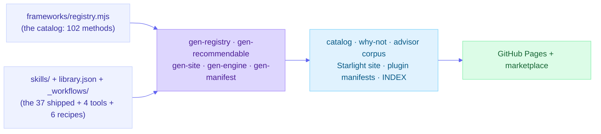

# Architecture

How this repo is built. The short version: there are two coordinated sources of truth - the **registry** (every thinking method the library has evaluated, with its verdict and grade) and the **skills** (the methods that actually shipped) - and everything else (the catalog, the advisor's corpus, the docs site, the plugin manifests) is a pure function of them, regenerated on every build and drift-checked in CI so it can never silently diverge.

## The two sources of truth

**1. The registry: every method we have judged.** `frameworks/registry.mjs` is the single source of truth for the *catalog* - all 102 thinking methods the library has evaluated, shipped or not. Each entry carries `slug`, `name`, `family`, evidence `tier`, `status`, `verdict`, `reasoning`, an optional `foldInto` target, an optional `dossierPath`, and - for branded methods - `attribution` + `trademark`. It is a zero-dependency ES data module (the repo's scripts are zero-dep and Node ships no YAML parser), validated against a committed JSON Schema, `frameworks/registry.schema.json`. The registry is where "we considered X and folded it into Y" lives, so a rejected method is a recorded decision, not an oversight.

**2. The skills: the methods that shipped.** Each shipped framework lives in `skills/think-<method>/` and is self-contained:

- `SKILL.md` - the agent-executable mechanism, with frontmatter (name, description, metadata: id, family, evidence-tier) and the numbered procedure.
- `evidence/dossier.md` - the graded sources and the honest "what the research does and does not show" note.
- `references/EXAMPLE.md` - a full worked run on the shared scenario, plus a `TEMPLATE.md` for the artifact.
- `skill.meta.yml` - the routing sidecar (primary artifact type, problem contexts, thinking modes).
- `eval/cases.md` - the trigger / anti-trigger / output-check cases for the skill.

The two are bound together in CI: every `status: shipped` registry entry must have a matching `skills/think-<slug>/` directory (both directions), and each shipped entry's governing `tier` must be one of the grades in its skill's `evidence-tier` - so the catalog grade can never drift from the grade the advisor and the site publish.

There are **37 shipped frameworks** across **10 cognitive-operation families**, plus **6 recipes** (composable chains) under `_workflows/` with their prose in `recipes/`. `library.json` is the manifest that lists every skill component, its path, and its version. Skills install with a `think-` prefix and carry IDs of the form `thinking-framework-skills.<method>`.

## Frameworks vs. tools (meta-skills)

Not every skill is a graded thinking method. Four skills are **tools** (meta-skills) - they operate *over* the library rather than being one of its methods:

| Tool | Role |
|---|---|
| `think-framework-advisor` | Router: describe a situation, get a prioritized Thinking Plan of which frameworks to run. |
| `think-top3` | Applicator: rank the most relevant frameworks, apply the top three, cross-synthesize. |
| `think-random-frameworks` | Applicator: draw three frameworks at random to break fixation. |
| `think-research-framework` | Research engine: grade a candidate method and propose a registry entry (see below). |

The discriminator is the registry itself: **a skill dir with no registry entry is a tool.** Tools are exempt from the registry's shipped-entry checks (the `META_SKILLS` exemption in `scripts/check-registry.mjs` and `scripts/gen-recommendable.mjs`), they are excluded from the advisor's recommendable corpus (a router must not recommend itself), and on the docs site they render under `/tools/` - with no evidence-tier badge and no domain, because they are not graded methods. Any evidence grade a tool carries (for example the advisor's routing grade) is about the tool's own behavior, not a framework grade.

## The generated-view principle: no second store

Nothing about a method is hand-duplicated. Every downstream surface is regenerated from the two sources and a `--check` mode byte-compares the committed output against a fresh generation, so a forgotten regenerate fails CI instead of shipping drift.

| Generator | Reads | Emits (all drift-checked) |
|---|---|---|
| `scripts/gen-registry.mjs` | the registry | the `framework-catalog.md` family tables + the public `about/why-not.md` index |
| `scripts/gen-recommendable.mjs` | the skills + recipes | the advisor's `recommendable.{json,md}` corpus (names, tiers, anti-triggers, when-not, overlaps); the registry cross-checks this corpus rather than feeding it |
| `scripts/gen-site.mjs` | the skills + registry + recipes + intros | the Starlight site (frameworks, tools, families, recipes, library, explore lenses, map, chooser, bibliography) |
| `scripts/gen-engine.mjs` | the shared applicator engine | the byte-identical copy of `engine.md` in `think-random-frameworks` |
| agent-skills-toolkit `gen-manifest` / `gen-index` | `library.json` | the native plugin manifests + `INDEX.md` |

Every generated page carries a do-not-hand-edit banner, and the site output is gitignored: you edit the source and regenerate, never the page.

## The conformance gate

`scripts/check.mjs` is the single required gate (a status check on `main`); CI runs it on every PR. It runs four layers in order, and any failure is a red build:

1. **Structural** - the `agent-skills-toolkit` validators (`evaluate.mjs`), pinned to a known-good ref, asserting the plugin meets the `advanced` tier with 0 errors / 0 warnings.
2. **Eval cases** (`scripts/eval-cases.mjs`) - every `skills/*/eval/cases.md` is well-formed and name-safe (no case may reference a framework that does not exist).
3. **Registry** (`scripts/check-registry.mjs`) - schema validation, generated-view drift, referential integrity (shipped <-> skill dir, fold targets resolve to a shipped skill, dossier paths and source URLs resolve), completeness, the IP/attribution lint, eval-coupling, tier consistency, and the registry <-> advisor recommendable cross-check.
4. **Engine drift** (`scripts/gen-engine.mjs --check`) - the shared applicator engine copy is in sync.

The docs site adds two build-time guards run after `astro build` (family Astro site standard, clause 14.11): `scripts/check-rendered-links.mjs` (no browser-broken internal links) and `scripts/check-route-parity.mjs` (no silently dropped published route, against the committed `scripts/route-manifest.txt`).

## The research-framework engine: how the catalog grows

New entries are not hand-invented. The `think-research-framework` engine (a `think-`-prefixed command -> backing meta-skill -> subagent in `agents/`) researches a candidate method, grades it conservatively on the seven-tier model with real sources, assesses overlap against the shipped catalog (distinct only above the ~20% overlap ceiling, else fold / recipe / reject), drafts a learning dossier to a staging path (`frameworks/_proposed/<slug>/`), and prints a schema-valid proposed registry entry validated by `scripts/check-proposed-entry.mjs`. It **never writes the registry** - it gives a human an honest, sourced basis to decide. A person admits the entry by pasting it in and promoting the dossier. This is the controlled on-ramp that keeps "honest evidence grading, not breadth" enforceable as the catalog expands.

## The hand-authored learning layer

The only hand-written content is the connective tissue the sources cannot generate: the learning layer under `site/src/content/docs/{start,learn,about,explore}` (getting-started, the evidence model, how-to-read-a-page, the learning tracks, philosophy, FAQ, the interactive chooser) and the per-family intros in `site/intros/families/`, which `gen-site.mjs` weaves into each domain page. The split is deliberate: generated content is reference, hand-authored content is teaching.

## Where this `docs/` folder fits

This `docs/` folder is the repo-browser and contributor layer - what you read when you are working in the repository rather than visiting the site. It covers how the library is built and how to add to it: this architecture overview, the [contributing gate](./contributing.md), the [concepts vocabulary](./concepts.md), the [conformance tiers](./conformance.md), and - under [`internal/`](./internal/) - the [authoring loop](./internal/AUTHORING.md) and the [release process](./internal/release-process.md). The polished, reader-facing version of the same material lives on the [live docs site](https://product-on-purpose.github.io/thinking-framework-skills/), generated from the same sources.
