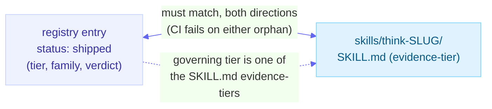
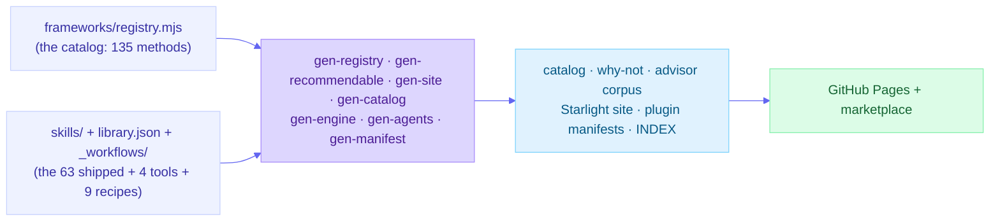

# Architecture

How this repo is built. The short version: there are two coordinated sources of truth - the **registry** (every thinking method the library has evaluated, with its verdict and grade) and the **skills** (the methods that actually shipped) - and everything else (the catalog, the advisor's corpus, the docs site, the plugin manifests) is a pure function of them, regenerated on every build and drift-checked in CI so it can never silently diverge.

## The two sources of truth

**1. The registry: every method we have judged.** `frameworks/registry.mjs` is the single source of truth for the *catalog* - all 135 thinking methods the library has evaluated, shipped or not. Each entry carries `slug`, `name`, `family`, evidence `tier`, `status`, `verdict`, `reasoning`, an optional `foldInto` target, an optional `dossierPath`, and - for branded methods - `attribution` + `trademark`. It is a zero-dependency ES data module (the repo's scripts are zero-dep and Node ships no YAML parser), validated against a committed JSON Schema, `frameworks/registry.schema.json`. The registry is where "we considered X and folded it into Y" lives, so a rejected method is a recorded decision, not an oversight.

**2. The skills: the methods that shipped.** Each shipped framework lives in `skills/think-<method>/` and is self-contained:

- `SKILL.md` - the agent-executable mechanism, with frontmatter (name, description, metadata: id, family, evidence-tier) and the numbered procedure.
- `evidence/dossier.md` - the graded sources and the honest "what the research does and does not show" note.
- `references/EXAMPLE.md` - a full worked run on the shared scenario, plus a `TEMPLATE.md` for the artifact.
- `skill.meta.yml` - the routing sidecar (primary artifact type, problem contexts, thinking modes).
- `eval/cases.md` - the trigger / anti-trigger / output-check cases for the skill.

The two are bound together in CI: every `status: shipped` registry entry must have a matching `skills/think-<slug>/` directory (both directions), and each shipped entry's governing `tier` must be one of the grades in its skill's `evidence-tier` - so the catalog grade can never drift from the grade the advisor and the site publish.

There are **63 shipped frameworks** across **12 cognitive-operation families** (56 core, plus 7 contested lenses), plus **9 recipes** (composable chains) under `_workflows/` with their prose in `recipes/`. `library.json` is the manifest that lists every skill component, its path, and its version. Skills install with a `think-` prefix and carry IDs of the form `thinking-framework-skills.<method>`.

A **contested lens** is a famous-but-weak framework (graded X/C/P) the library ships *caveat-first*: the deficiency leads the SKILL.md and the artifact, the advisor never auto-recommends it (`recommendation_policy: explicit_request_only`), and a `caveatFirst` + `posture` marker in `frameworks/registry.mjs` is enforced by `scripts/check-contested.mjs`. Two postures: `run_caveat_first` (lead with the deficiency, then still produce the weak artifact) and `warn_redirect` (own the famous name, warn, and route to an evidence-based alternative without reproducing the discredited artifact).

The registry and shipped skills maintain a bidirectional integrity contract:

### Metadata sourcing: cross-check, not full generation (registry follow-up #2, resolved: keep)

The advisor's `recommendable.{json,md}` and the site framework pages derive each skill's tier / family / description from its `SKILL.md` (and `skill.meta.yml`), and the registry **cross-checks** that the shipped-slug set matches and that each shipped entry's governing tier is one of the grades in its `SKILL.md` evidence-tier. That cross-check closes the drift loop without making the registry the literal source of those surfaces. The stronger move - *generating* the advisor/site metadata from the registry so there is one byte-level source - is deliberately **not** taken: the registry stores a single governing grade, so generating `recommendable.json` from it would lose the per-skill compound grade (e.g. `M/P`) unless the registry schema grew to store it, and the cross-check already prevents divergence. The decision is to keep the per-skill source plus the registry cross-check.

### Two family taxonomies, kept separate by design (registry follow-up #3, resolved: documented mapping)

There are two family taxonomies, cut for different jobs, and they are deliberately **not** 1:1:

- The registry's **13-family catalog universe** (`frameworks/registry.mjs` `family`): the research/evaluation taxonomy over all 135 methods, shipped or not. Two of the 13 (`facilitation-and-group-structures`, `self-and-team-awareness`) have no shipped skills - they exist to classify documented-only methods (group facilitation, person/team instruments).
- The coarser **12-slug skill taxonomy** (`SKILL.md` `metadata.family`): the user-facing grouping the README catalog sections and the Astro `families/` pages use.

They crisscross (they are not just a coarsening): the catalog merges synthesis and reasoning-clarity into one family while the skill taxonomy splits them, and `reasoning-clarity` (skill) draws from two catalog families. `scripts/check-counts.mjs` validates that every skill's `metadata.family` is one of the 12 canonical slugs (a typo guard) but deliberately enforces no registry-to-skill family match, because unifying them would reshuffle user-facing groupings for no correctness gain. The mapping (dominant target per catalog family; cross-family cases noted):

| Registry catalog family | Skill `metadata.family` | Note |
|---|---|---|
| perspective-shifting-and-multi-lens | perspective-and-multi-lens | a few methods group under assumption-and-belief-challenge |
| divergent-ideation-and-idea-expansion | divergent-ideation | |
| problem-framing-and-reframing | problem-framing | |
| assumption-and-belief-challenge | assumption-and-belief-challenge | some methods group under reasoning-clarity or decision-and-option-evaluation |
| risk-failure-and-resilience | risk-and-resilience | |
| systems-and-consequences | systems-and-consequences | |
| decision-and-option-evaluation | decision-and-option-evaluation | one method (the decision journal) groups under meta-thinking-and-reflection |
| strategy-and-opportunity | strategy-and-opportunity | |
| synthesis-and-reasoning-clarity | synthesis + reasoning-clarity | the catalog merges these; the skill taxonomy splits them |
| facilitation-and-group-structures | (none shipped) | catalog-only |
| meta-thinking-and-reflection | meta-thinking-and-reflection | |
| self-and-team-awareness | (none shipped) | catalog-only |
| ethics-values-deliberation | ethics-values-deliberation | |

## Frameworks vs. tools (meta-skills)

Not every skill is a graded thinking method. Four skills are **tools** (meta-skills) - they operate *over* the library rather than being one of its methods:

| Tool | Role |
|---|---|
| `think-framework-advisor` | Router: describe a situation, get a prioritized Thinking Plan of which frameworks to run. |
| `think-top3` | Applicator: rank the most relevant frameworks, apply the top three, cross-synthesize. |
| `think-random-frameworks` | Applicator: draw three frameworks at random to break fixation. |
| `think-research-framework` | Research engine: grade a candidate method and propose a registry entry (see below). |

The discriminator is the registry itself: **a skill dir with no registry entry is a tool.** Tools are exempt from the registry's shipped-entry checks (the `META_SKILLS` exemption in `scripts/check-registry.mjs` and `scripts/gen-recommendable.mjs`), they are excluded from the advisor's recommendable corpus (a router must not recommend itself), and on the docs site they render under `/tools/` - with no evidence-tier badge and no domain, because they are not graded methods. Any evidence grade a tool carries (for example the advisor's routing grade) is about the tool's own behavior, not a framework grade.

## The generated-view principle: no second store

Nothing about a method is hand-duplicated. Every downstream surface is regenerated from the two sources and a `--check` mode byte-compares the committed output against a fresh generation, so a forgotten regenerate fails CI instead of shipping drift.

| Generator | Reads | Emits (all drift-checked) |
|---|---|---|
| `scripts/gen-registry.mjs` | the registry | the `framework-catalog.md` family tables + the public `about/why-not.md` index |
| `scripts/gen-recommendable.mjs` | the skills + recipes | the advisor's `recommendable.{json,md}` corpus (names, tiers, anti-triggers, when-not, overlaps); the registry cross-checks this corpus rather than feeding it |
| `scripts/gen-site.mjs` | the skills + registry + recipes + intros | the Starlight site (frameworks, tools, families, recipes, library, explore lenses, map, chooser, bibliography) |
| `scripts/gen-catalog.mjs` | the registry + skills + recipes | the machine-readable agent-discovery surface served at the site root: `site/public/{llms.txt, llms-full.txt, catalog.json, evaluated.json}` |
| `scripts/gen-engine.mjs` | the shared applicator engine | the byte-identical copy of `engine.md` in `think-random-frameworks` |
| `scripts/gen-agents.mjs` | the registry + skills + `_workflows/` | the `AGENTS.md` Skills + Recipes tables (the contributor/agent guide) |
| agent-skills-toolkit `gen-manifest` / `gen-index` | `library.json` | the native plugin manifests + `INDEX.md` |

Every generated page carries a do-not-hand-edit banner, and the site output is gitignored: you edit the source and regenerate, never the page.

## The conformance gate

`scripts/check.mjs` is the single required gate (a status check on `main`); CI runs it on every PR. It runs fourteen layers in order, and any failure is a red build:

1. **Structural** - the `agent-skills-toolkit` validators (`evaluate.mjs`), pinned to a known-good ref, asserting the plugin meets the `advanced` tier with 0 errors / 0 warnings.
2. **Eval cases** (`scripts/eval-cases.mjs`) - every `skills/*/eval/cases.md` is well-formed and name-safe (no case may reference a framework that does not exist).
3. **Registry** (`scripts/check-registry.mjs`) - schema validation, generated-view drift, referential integrity (shipped <-> skill dir, fold targets resolve to a shipped skill, dossier paths and source URLs resolve), completeness, the IP/attribution lint, eval-coupling, tier consistency, and the registry <-> advisor recommendable cross-check.
4. **Engine drift** (`scripts/gen-engine.mjs --check`) - the shared applicator engine copy is in sync.
5. **AGENTS.md drift** (`scripts/gen-agents.mjs --check`) - the generated Skills + Recipes tables in the contributor/agent guide are in sync with the catalog, so the agent-facing roster cannot silently fall behind.
6. **Counts** (`scripts/check-counts.mjs`) - the four hand-authored count surfaces in `README.md` (the badges, the lifecycle map, the catalog table headers, and the project-status table) match the registry / `_workflows/` / tools, and every shipped skill's `metadata.family` is a valid skill-family slug. The README is the last hand-authored denormalization of catalog counts; this layer makes a stale count a red build instead of a late review catch.
7. **Example coverage** (`scripts/check-example-coverage.mjs`) - every shipped skill has a worked example (a Showcase appearance or a sample) or is grandfathered in `scripts/example-coverage-baseline.txt`; a newly shipped skill with no example reds the build, so the example layer cannot fall behind the catalog. The grandfather set can only shrink.
8. **Catalog drift** (`scripts/gen-catalog.mjs --check`) - the machine-readable agent-discovery surface (`llms.txt`, `llms-full.txt`, `catalog.json`, `evaluated.json`) is byte-identical to a fresh generation.
9. **Contested-lens contract** (`scripts/check-contested.mjs`) - every contested lens (a `caveatFirst` registry entry) leads with its evidence caveat across `SKILL.md` / `TEMPLATE` / `EXAMPLE` / sample / eval-cases per its posture (`run_caveat_first` or `warn_redirect`), a branded lens carries its trademark attribution on every surface, and the marker agrees across the registry, the SKILL.md frontmatter, and the `skill.meta.yml` sidecar. The deterministic core is `scripts/lib/contested-lib.mjs` (unit-tested, both postures negative-tested).
10. **Mermaid validity** (`scripts/check-mermaid.mjs`) - every mermaid block in repo docs and committed site content is syntactically valid, so a broken diagram cannot silently ship.
11. **Canonical links** (`scripts/check-canonical-links.mjs`) - every internal link in the repo docs resolves without redirect hops, so stale paths surface immediately.
12. **Repo-markdown links** (`scripts/check-repo-links.mjs`) - every relative link in repo-facing markdown resolves to a file or anchor that actually exists.
13. **Changelog consistency** (`scripts/check-changelog.mjs`) - `CHANGELOG.md` and `RELEASE-NOTES.md` agree on the most recent version, so a version bump cannot update one file and forget the other.
14. **Eval-results pairing + shape check** (`scripts/check-eval-results.mjs`) - every behavioral-eval scorecard under `docs/internal/eval-results/` is a paired `.md` + `.json` with a valid totals contract.

The docs site adds three build-time guards run after `astro build` (family Astro site standard, clause 14.11): `scripts/check-mermaid.mjs` (generated-content mermaid validation), `scripts/check-rendered-links.mjs` (no browser-broken internal links), and `scripts/check-route-parity.mjs` (no silently dropped published route, against the committed `scripts/route-manifest.txt`).

## The research-framework engine: how the catalog grows

New entries are not hand-invented. The `think-research-framework` engine (a `think-`-prefixed command -> backing meta-skill -> subagent in `agents/`) researches a candidate method, grades it conservatively on the seven-tier model with real sources, assesses overlap against the shipped catalog (distinct only above the ~20% overlap ceiling, else fold / recipe / reject), drafts a learning dossier to a staging path (`frameworks/_proposed/<slug>/`), and prints a schema-valid proposed registry entry validated by `scripts/check-proposed-entry.mjs`. It **never writes the registry** - it gives a human an honest, sourced basis to decide. A person admits the entry by pasting it in and promoting the dossier. This is the controlled on-ramp that keeps "honest evidence grading, not breadth" enforceable as the catalog expands.

## The hand-authored learning layer

The only hand-written content is the connective tissue the sources cannot generate: the learning layer under `site/src/content/docs/{start,learn,showcase,samples,about,explore}` (getting-started, the evidence model, how-to-read-a-page, the learning tracks, philosophy, FAQ, the interactive chooser, the Showcase of decisions worked end to end - including the cross-library tfs -> pm-skills threads - and the per-framework Samples shelf) and the per-family intros in `site/intros/families/`, which `gen-site.mjs` weaves into each domain page. The split is deliberate: generated content is reference, hand-authored content is teaching.

## Where this `docs/` folder fits

This `docs/` folder is the repo-browser and contributor layer - what you read when you are working in the repository rather than visiting the site. It covers how the library is built and how to add to it: this architecture overview, the [contributing gate](./contributing.md), the [concepts vocabulary](./concepts.md), the [conformance tiers](./conformance.md), and - under [`internal/`](./internal/) - the [authoring loop](./internal/AUTHORING.md) and the [release process](./internal/release-process.md). The polished, reader-facing version of the same material lives on the [live docs site](https://thinking-framework-skills.productonpurpose.com/), generated from the same sources.
