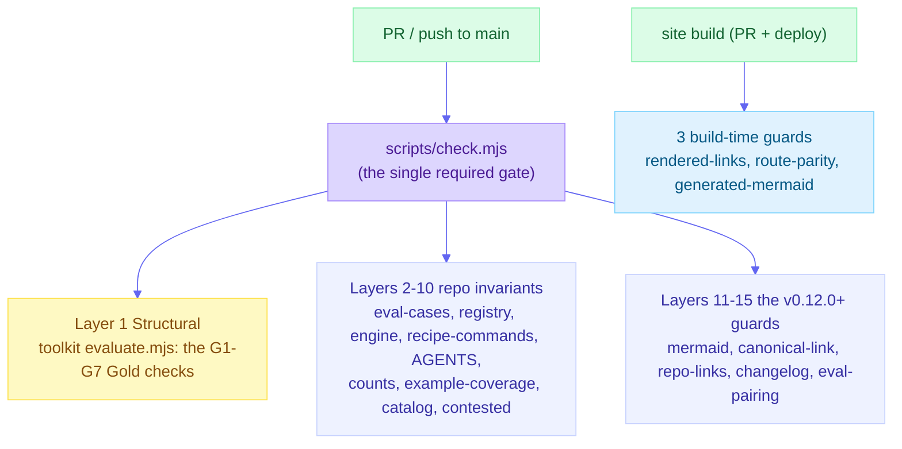

# Conformance: how this plugin reaches advanced (Gold) tier

`thinking-framework-skills` is built to the [agent-skills-toolkit](https://github.com/product-on-purpose/agent-skills-toolkit) **Advanced Skill Library Standard** ([`STANDARD.md`](https://github.com/product-on-purpose/agent-skills-toolkit/blob/main/STANDARD.md)). This page is the check-by-check breakdown behind the one-line claim in the README: *validates at advanced (Gold), 0 errors, against Standard 0.8.*

**Two dials, and confusing them is the easiest mistake to make here.**

| Dial | Where | What it controls |
|---|---|---|
| **Pinned toolkit** | `.github/workflows/ci.yml` `ref:` | *Which validator runs.* Deliberately newer than the declared Standard |
| **Declared Standard** | `library.json` `"standard"` | *Which version of the rules the library holds itself to.* Currently `0.8` |

Running a newer validator against an older declared Standard is supported by design. Findings from rules introduced after the declared version are held at `warn` by a version ceiling instead of counted as failures, so a consumer can take validator bug-fixes without being forced to adopt every new requirement in the same step. That is exactly what this repo does.

**The current run: 0 errors, 90 warnings.** The error count is the number that gates, and it is zero.

- **83 are post-0.8 documentation requirements**, introduced at Standard 0.10 and later: 71 `G8` (folder READMEs), 7 `G7` (docs frontmatter), and 5 `G10` (Diataxis coverage). The fourth family, `G9` (source docblocks), was 39 and is now **zero**: every hand-authored file under `scripts/` carries its four-field header docblock. The rest is real work not yet done, held at `warn` by the ceiling. **Measured, not estimated:** declaring `0.13` instead of `0.8` returns **convergent, 84 errors, 7 warnings**, which is precisely why adopting a newer Standard is a project with its own release rather than a one-line bump.
- **7 are `U5`** (description quality) on the seven contested lenses. They exist because those descriptions lead with an evidence caveat rather than a trigger phrase, which a heuristic tuned for discoverability marks down. This is a real tension, not an oversight: the caveat-first contract (gate layer 10) requires the deficiency to lead, and `U5` rewards leading with what the skill does and when to use it. The library keeps the caveat and carries the warnings, because rewording seven descriptions to score better than the evidence warrants is exactly the laundering this project exists to refuse. If a future Standard offers a way to declare that tension explicitly, taking it upstream is preferable to either side quietly winning.

**Provenance of the count**, so a reader can tell drift from change: `0 errors / 0 warnings` through v0.10.0; `0 errors / 7 warnings` from v0.11.0 when the contested lenses shipped; `0 errors / 128 warnings` from v0.13.x when the toolkit pin moved forward to pick up the workflow-component fix; `0 errors / 129 warnings` once `docs/troubleshooting.md` shipped without taxonomy frontmatter, adding one more `G7`; `0 errors / 90 warnings` once the `G9` docblock sweep paid off all 39 source-docblock warnings. The published claim was not updated at the v0.11.0 step and read `0 / 0` until 2026-08-15, when grading against the pinned ref caught it.

**The count is asserted, not re-typed (since 2026-09-11).** It had gone stale four times - at v0.11.0 when the contested lenses shipped, when `docs/troubleshooting.md` shipped without taxonomy frontmatter, again when the skill-selection eval added four source files with no header docblock, and again when the `G9` docblock sweep took it 129 -> 90. A number hand-copied onto several pages goes stale on all but one of them, and CI already runs the evaluator, so the figure is now proved rather than promised.

The fourth time exposed a gap in the fix for the third: only the headline **total** was asserted. The three figures published *beside* it - the post-0.8 subtotal, the per-requirement breakdown, and the Standard-0.13 counterfactual - appeared in six further live sentences and were asserted nowhere, so the sweep would have left six freshly false claims behind a green gate. Four comparisons now do it:

1. `scripts/check.mjs` reads the headline `N error(s), M warning(s).` line from the live evaluator run and fails if it disagrees with `docs/internal/gate-warning-count.txt` - the single canonical number.
2. `scripts/check.mjs` also tallies the run's `[warn] <REQ>:` lines and fails if the per-requirement breakdown disagrees with `docs/internal/gate-composition.json`, **in both directions**. A new requirement family appearing is the obvious drift; a family *disappearing* is the one that actually happened, and a one-way check would have called it a pass while every page went on naming 39 source-docblock warnings.
3. `scripts/check-counts.mjs` asserts every present-tense published claim about the total against `gate-warning-count.txt`, and every claim about the subtotal against `gate-composition.json` (the subtotal is **derived** from the breakdown rather than stored, so the two cannot disagree). `scripts/lib/warning-count-lib.mjs` names all thirteen surfaces.
4. `scripts/check-counts.mjs` asserts the Standard-0.13 counterfactual against the same file. This one is honestly weaker and the file says so: producing that number requires temporarily declaring `0.13` in `library.json`, which CI must not do, so the value is **measured by hand at each release cut** and the gate proves only that the prose agrees with the recorded measurement. Re-measuring is a release-process step, not something a check can discover.

So a commit that adds a warning reds the gate and forces an explicit choice: fix the warning, or move the canonical numbers and the prose together. The historical sentences above are deliberately **not** asserted - they are dated records and keep their original numbers, and a test reds if any pattern ever widens far enough to match them.


**Why the pin moved.** The previous pin predated agent-skills-toolkit ADR 0047, whose validator could not resolve a command mapped to a workflow: it reported `maps-to "x" but no skill or workflow by that name exists on disk` for files that were on disk. That made the nine recipe commands unshippable. Moving the pin was the honest fix; suppressing the check would have traded a true statement for a passing gate.

If you only want to verify it yourself, skip to [Reproduce it locally](#reproduce-it-locally).

## The three tiers

The Standard grades a plugin (a "skill library") on three tiers. The tiers are cumulative: each one includes every requirement below it.

| Tier | Toolkit name | What it certifies | Audience |
|---|---|---|---|
| 🥉 Bronze | `universal` | The skills are **portable**: valid frontmatter, `name` equals the directory, descriptions meet the quality bar, references one level deep, an `AGENTS.md` at the root, and a minimal `library.json`. The identical files run on any agentskills.io-compatible agent (around 50 of them). | beginner on-ramp |
| 🥈 Silver | `convergent` | The plugin declares its **agent targets** and emits each higher-order component (slash commands, workflows, subagents, chain contracts) in the correct format for both Claude Code and Codex. Chain contracts are valid (no orphans or phantoms), the manifest matches what is on disk, and versions follow semver. | intermediate |
| 🥇 Gold | `advanced` | The plugin **proves itself**: it ships CI that runs the Standard's own validators against it and passes (self-hosting), generates its `INDEX.md` and native manifests from one authored source, and maintains release notes plus a deprecation policy. A Gold plugin is, by construction, a self-proving example of the Standard. | advanced |

A plugin declares its tier in [`library.json`](../library.json) (`"tier": "advanced"`) and the toolkit's evaluator verifies the highest tier it actually satisfies, reporting any requirement that blocks the next tier up.

## The Gold checks (G1-G7), and how this plugin meets each

The Standard freezes the Gold requirements as G1 through G7. Here is each one and how `thinking-framework-skills` satisfies it.

| # | Gold requirement | Status here | How |
|---|---|---|---|
| **G1** | Every hook documents its event, trigger, matcher, scope, and failure behavior. | **N/A (vacuous)** | This plugin ships **no hooks**, so there is nothing to document. The check passes because there is nothing to fail. |
| **G2** | Self-hosting CI that runs the full tier-applicable check suite and passes. | **Met** | [`.github/workflows/ci.yml`](../.github/workflows/ci.yml) runs [`scripts/check.mjs`](../scripts/check.mjs) on every PR and push to `main`. `check.mjs` locates a toolkit checkout and runs the toolkit's `evaluate.mjs` against this repo - it holds **no validation logic of its own**, so the rules cannot drift from the Standard. `check` is a **required status check** on `main`. |
| **G3** | Each chain contract and each hook has at least one eval/regression case, executed in CI. | **N/A (vacuous)** | This plugin ships **no hooks and no runtime chain contracts**. Its recipes are workflow components that chain *independent* skills (each runnable alone), not `chain:` contracts between coupled components, so the contract is empty (`agents/_chain-permitted.yaml` is `{}`). Nothing to cover. Note: every skill still ships its own `eval/cases.md` (triggers, anti-triggers, output checks) as a quality practice, even though the Standard does not require it here. |
| **G4** | `INDEX.md`, the native plugin manifests, and `manifest.generated.json` are **generated** from the authored `library.json` + component frontmatter, and drift-checked. A hand-edited generated file is an error. | **Met** | [`INDEX.md`](../INDEX.md), [`.claude-plugin/plugin.json`](../.claude-plugin/plugin.json), the Codex manifest, and [`manifest.generated.json`](../manifest.generated.json) are produced by the toolkit's `gen-index` / `gen-manifest` from the authored [`library.json`](../library.json) and checked for drift in CI. |
| **G5** | The plugin maintains `RELEASE-NOTES.md` (curated, user-facing), distinct from `CHANGELOG.md`. | **Met** | [`RELEASE-NOTES.md`](../RELEASE-NOTES.md) (curated highlights) and [`CHANGELOG.md`](../CHANGELOG.md) (Keep a Changelog, technical) are both maintained and kept distinct. |
| **G6** | A deprecation policy: `status` / `deprecated-by` / `remove-in` handling, recognized by tooling. | **Met** | Component frontmatter carries `status` (every skill is `active`), and the manifest pipeline handles the deprecation fields. No component is deprecated today; the policy and handling are in place for when one is. |
| **G7** | All Bronze + Silver requirements, by inclusion. | **Met** | Bronze (portable skills, `AGENTS.md`, manifest) and Silver (`agent-targets: [claude, codex]`, per-target manifests, a valid chain contract, manifest-matches-disk) all pass. |

The honest part of this table is the two **N/A** rows. G1 and G3 are not "skipped" or waived - they have no surface to apply to, because the library deliberately ships no hooks and no coupled chains. The toolkit's evaluator treats them as satisfied, and a future version of this plugin that *did* add a hook or a chain contract would have to satisfy them for real.

## Why "self-hosting" matters

The defining move of Gold is **G2**: the plugin does not just claim conformance, it runs the conformance checker against itself in CI and blocks merges that fail. Two design choices make that trustworthy here:

- **No second source of truth.** `scripts/check.mjs` is a thin locator that shells out to the toolkit's `evaluate.mjs`. The checks live in the toolkit, not vendored into this repo where they could quietly diverge.
- **Reproducible by anyone.** CI clones the toolkit at a pinned commit and runs the same command a contributor runs locally, so a green check is something you can re-derive, not take on faith.

## Reproduce it locally

```bash
# 1. Clone this repo
git clone https://github.com/product-on-purpose/thinking-framework-skills.git
cd thinking-framework-skills

# 2. Clone the toolkit AT THE REF CI PINS, and install it. The ref lives in one place:
#    the `ref:` value in .github/workflows/ci.yml. Do not copy it into a second file.
git clone https://github.com/product-on-purpose/agent-skills-toolkit.git .agent-skills-toolkit
git -C .agent-skills-toolkit checkout <the ref from ci.yml>
npm --prefix .agent-skills-toolkit ci

# 3. Run the gate (the same command CI runs)
node scripts/check.mjs
```

Expected: `Tier: advanced` with `0 error(s), 90 warning(s)`, and an exit code of 0. The ref matters: grading against the toolkit's `main` reports check families the pinned run does not, which is confusing rather than informative. `check.mjs` finds the toolkit via `AGENT_SKILLS_TOOLKIT`, a sibling `../agent-skills-toolkit`, or a local `./.agent-skills-toolkit` checkout (the path CI uses).

## The check.mjs gate: fifteen layers

`scripts/check.mjs` is the repo's own conformance gate - distinct from the toolkit's G1-G7 Gold requirements. The toolkit's G2 requires self-hosting CI that runs the Standard's validators; `check.mjs` is that CI, and it does more than G2 requires. Its fifteen layers are:

1. **Structural** (`agent-skills-toolkit` `evaluate.mjs`) - the toolkit's portable validators; the plugin must pass at `advanced` tier with 0 errors. Seven `U5` warnings on the contested lenses are accepted and explained at the top of this page.
2. **Eval cases** (`scripts/eval-cases.mjs`) - every `skills/*/eval/cases.md` is well-formed and name-safe.
3. **Registry** (`scripts/check-registry.mjs`) - schema, generated-view drift, referential integrity, IP/attribution lint, eval-coupling, tier consistency, registry cross-check, lifecycle-metadata truth (every skill on disk says `status: active`, and a skill with both eval stamps measured says `maturity: measured`), and the workflows mirror (`library.json` `components.workflows` and `_workflows/` describe the same set, both directions). Both rule sets are pure libs (`scripts/lib/lifecycle-lib.mjs`, `scripts/lib/workflow-mirror-lib.mjs`) so the guards are unit-tested rather than only exercised against the real tree.
4. **Engine drift** (`scripts/gen-engine.mjs --check`) - the shared applicator engine copy is byte-identical.
5. **Recipe-command drift** (`scripts/gen-recipe-commands.mjs --check`) - every `commands/think-<recipe>.md` is regenerated byte-identically from its `_workflows/` source, so a hand-edited recipe command cannot drift from the chain it claims to run.
6. **AGENTS.md drift** (`scripts/gen-agents.mjs --check`) - the Skills + Recipes tables in the agent guide are in sync with the catalog.
7. **Counts** (`scripts/check-counts.mjs`) - the four hand-authored count surfaces in `README.md` match the registry, and every shipped skill's `metadata.family` is a valid slug.
8. **Example coverage** (`scripts/check-example-coverage.mjs`) - every shipped skill has a worked example or a grandfathered baseline entry; the grandfather set can only shrink.
9. **Catalog drift** (`scripts/gen-catalog.mjs --check`) - the machine-readable agent-discovery surface (`llms.txt`, `llms-full.txt`, `catalog.json`, `evaluated.json`) is byte-identical to a fresh generation.
10. **Contested-lens contract** (`scripts/check-contested.mjs`) - every `caveatFirst` registry entry leads with its evidence caveat on every surface, and the marker agrees across the registry, SKILL.md frontmatter, and `skill.meta.yml`.
11. **Mermaid validity** (`scripts/check-mermaid.mjs`) - every mermaid block in repo docs and committed site content is syntactically valid.
12. **Canonical links** (`scripts/check-canonical-links.mjs`) - every internal link in repo docs resolves without redirect hops.
13. **Repo-markdown links** (`scripts/check-repo-links.mjs`) - every relative link in repo-facing markdown resolves to a file or anchor that exists.
14. **Changelog consistency** (`scripts/check-changelog.mjs`) - `CHANGELOG.md` and `RELEASE-NOTES.md` agree on the most recent version, and no version block repeats a Keep a Changelog change type.
15. **Eval-results pairing + shape check** (`scripts/check-eval-results.mjs`) - every behavioral-eval scorecard under `docs/internal/eval-results/` is a paired `.md` + `.json` with a valid totals contract.

The gate structure combines the toolkit's G1-G7 Standard requirements with the repo's own layers:



**These fifteen layers are not the same as the Standard's G1-G7 Gold requirements.** The G1-G7 list (in [`STANDARD.md`](https://github.com/product-on-purpose/agent-skills-toolkit/blob/main/STANDARD.md)) is the toolkit's frozen tier specification: what a plugin must satisfy to reach Gold. Layer 1 of `check.mjs` runs those validators (satisfying G2). Layers 2-15 are repo-specific guards added on top of the Standard's floor: they enforce repo invariants (registry integrity, count drift, changelog consistency, link health, scorecard pairing) that the Standard does not specify and that would otherwise require human review on every PR. The two lists address different questions: G1-G7 asks "does this plugin meet the Standard?", and the fifteen `check.mjs` layers ask "is this specific repo internally consistent?"

## See also

- [`docs/architecture.md`](architecture.md) - how the skills become the generated docs site, and the full conformance-gate description.
- [`docs/contributing.md`](contributing.md) - the selection bar and authoring loop for new skills.
- [agent-skills-toolkit / STANDARD.md](https://github.com/product-on-purpose/agent-skills-toolkit/blob/main/STANDARD.md) - the full Standard, including the frozen Gold criteria (Section 2.6).
