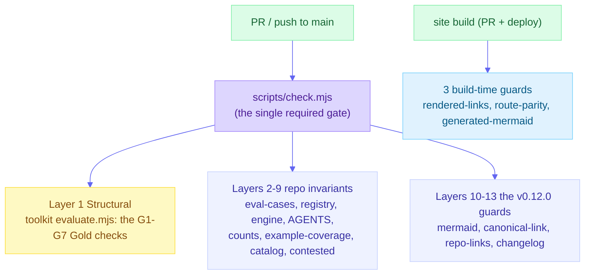
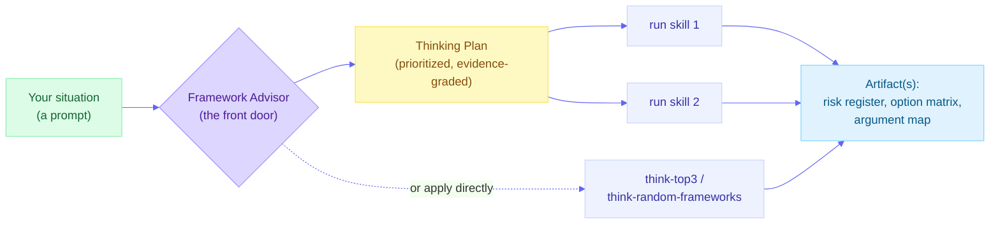
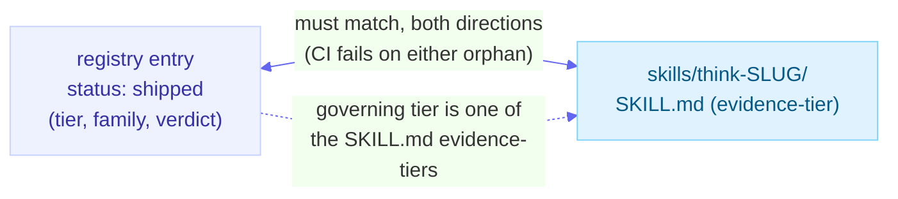
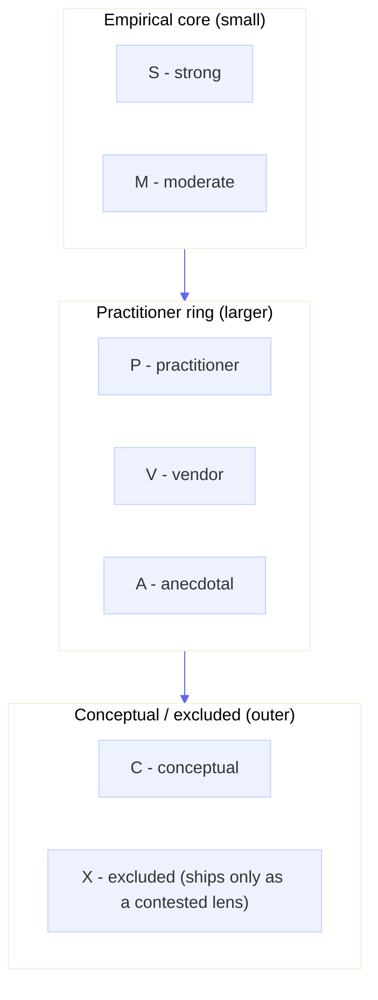
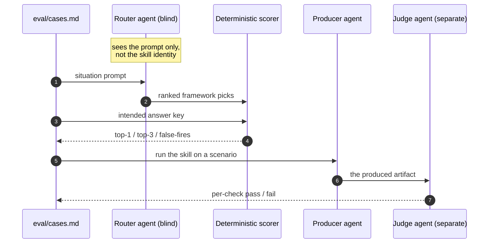
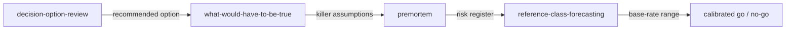
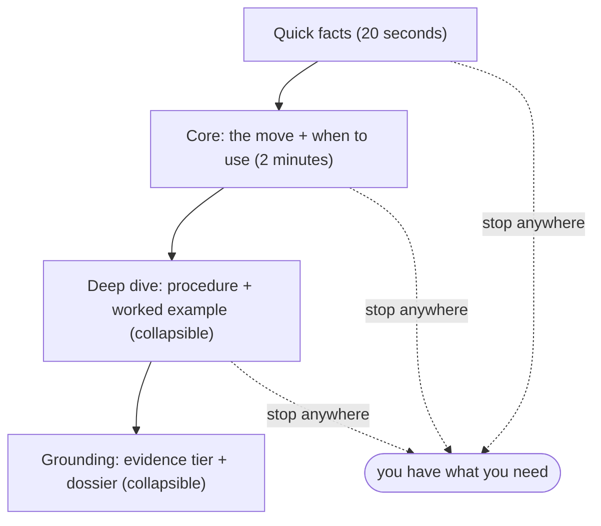
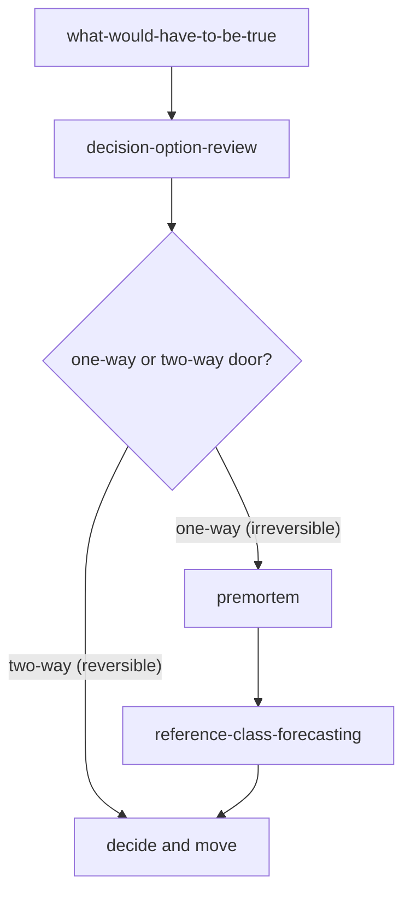

# Mermaid Diagrams Implementation Plan (Plan 4 of 5)

> **For agentic workers:** REQUIRED SUB-SKILL: Use superpowers:subagent-driven-development. Steps use checkbox (`- [ ]`) syntax.

**Goal:** Add 8 comprehension diagrams across the repo docs (GitHub-rendered) and the site (astro-mermaid). The 9th diagram in the spec (the changelog release timeline) already shipped in Plan 1.

**Architecture:** Each diagram below is **already authored and MCP-validated** (`valid=true`). This plan is transcription: insert each exact block at the named location. Repo-doc diagrams carry the inline `%%{init}%%` theme (GitHub native mermaid); site-page diagrams carry NO inline theme (they inherit the astro-mermaid global theme from `astro.config.mjs`).

**Spec:** `docs/internal/specs/2026-06-20-changelog-docs-audit-diagrams.md` (Workstream C). Release plan: `docs/internal/release-plans/plan_v0.12.0/`.

## Global Constraints

- **No em-dashes or en-dashes** anywhere (the diagrams + intro sentences use plain hyphens only).
- **Transcribe the mermaid blocks EXACTLY** as given (they are MCP-validated; do not "improve" them - a change can break rendering or the structural mermaid gate).
- Repo diagrams (conformance, README, architecture, concepts): keep the inline `%%{init}%%` line. Site diagrams (does-this-work, composing, how-to-read-a-page, decide-under-uncertainty): NO inline `%%{init}%%` (astro-mermaid themes them).
- The `check-mermaid` gate (layer added in Plan 2) validates every block structurally; the build renders the site ones; GitHub renders the repo ones.
- Build phase: record in `CHANGELOG.md [Unreleased]`; no version bump.
- Commit messages end with the two trailers (`Co-Authored-By: Claude Opus 4.8 <noreply@anthropic.com>` / `Claude-Session: https://claude.ai/code/session_01Re4ykqK5GHaeVvvS5P7boj`).

---

### Task 1: The 4 repo-doc diagrams (GitHub-rendered, inline theme)

**Files:** `docs/conformance.md`, `README.md`, `docs/architecture.md`, `docs/concepts.md`. Read each to find the right insertion point (named below); add a one-line lead-in sentence if the surrounding prose does not already introduce it. Commit once (all 4) or per-file.

**1a - `docs/conformance.md`** - place near the 13-layer enumeration (added in Plan 2), as a visual of the gate. It shows that layer 1 IS the toolkit's G1-G7 (resolving the "9 vs 7 vs 13" confusion):



**1b - `README.md`** - place in the section that pitches the Framework Advisor as the front door (the quick-start / "how it fits"). Shows situation -> advisor -> Thinking Plan -> skills -> artifact, with the apply-directly branch:



**1c - `docs/architecture.md`** - place in the "two sources of truth" section (it already has the data-flow diagram; this is a SECOND diagram showing the registry<->skills bidirectional integrity contract):



**1d - `docs/concepts.md`** - place at the evidence-tier explanation (the "small empirical core, large practitioner ring" metaphor). Grouped subgraphs convey the rings (mermaid has no literal rings):



- [ ] Insert 1a-1d at the named locations (add a brief lead-in sentence where needed; keep the inline theme line). 
- [ ] Verify: `node scripts/check-mermaid.mjs README.md docs` (0 issues) + `node scripts/check.mjs` (0 errors; the repo-links + mermaid layers see the new blocks). Commit.

```bash
git add docs/conformance.md README.md docs/architecture.md docs/concepts.md
git commit -m "docs(diagrams): add the conformance-gate, advisor-flow, registry-integrity, and tier-landscape diagrams"
```

---

### Task 2: The 4 site-page diagrams (astro-mermaid, NO inline theme)

**Files:** `site/src/content/docs/start/does-this-work.mdx`, `learn/composing.md`, `start/how-to-read-a-page.mdx`, `learn/decide-under-uncertainty.md`. Read each to find the right spot; add a one-line lead-in if needed. NO inline `%%{init}%%`.

**2a - `start/does-this-work.mdx`** - place near the "nothing grades itself" explanation (the blind eval harness):



**2b - `learn/composing.md`** - place at the recipe-handoff explanation (the stress-test-decision chain; each edge is the compressed artifact crossing the boundary):



**2c - `start/how-to-read-a-page.mdx`** - place at the four progressive-disclosure layers explanation:



**2d - `learn/decide-under-uncertainty.md`** - place at the decision-stack explanation (the one-way/two-way reversibility branch):



- [ ] Insert 2a-2d at the named locations (no inline theme). 
- [ ] Verify: `cd site && npm run build` (succeeds; astro-mermaid renders the blocks), then `STRICT_ANCHORS=1 node ../scripts/check-rendered-links.mjs dist` (0 broken) + `node ../scripts/check-mermaid.mjs src/content/docs` (0 issues, validates the new blocks in context). Confirm each page's HTML contains mermaid markup. Commit.

```bash
git add site/src/content/docs/start/does-this-work.mdx site/src/content/docs/learn/composing.md site/src/content/docs/start/how-to-read-a-page.mdx site/src/content/docs/learn/decide-under-uncertainty.md
git commit -m "docs(diagrams): add the eval-harness, recipe-handoff, page-layers, and decision-stack diagrams"
```

---

### Task 3: CHANGELOG [Unreleased] + full verification

**Files:** `CHANGELOG.md`.

- [ ] Add an `### Added` bullet under `## [Unreleased]`: "**Eight comprehension diagrams** across the docs - the conformance gate, the advisor-to-artifact flow, the registry<->skills integrity contract, and the evidence-tier landscape (repo docs); the blind eval harness, the recipe handoff, the four-layer page model, and the decision stack (site) - rendering via GitHub-native mermaid (repo) and astro-mermaid (site)." No version bump.
- [ ] Full verification (capture each): `npm test` (pass); `node scripts/check.mjs` (13 layers, 0 errors); `cd site && npm run build` + `STRICT_ANCHORS=1 node ../scripts/check-rendered-links.mjs dist` (0 broken) + `node ../scripts/check-route-parity.mjs dist` (no removed) + `node ../scripts/check-mermaid.mjs src/content/docs` (0 issues). All must pass; BLOCKED if not.
- [ ] Commit `CHANGELOG.md`.

```bash
git add CHANGELOG.md && git commit -m "docs: record the 8 comprehension diagrams in CHANGELOG [Unreleased]"
```

---

## Self-Review

- **Spec coverage (Workstream C):** all 9 spec diagrams - #9 (changelog timeline) shipped in Plan 1; #1-8 here (conformance, eval-harness, advisor, recipe-handoff, page-layers, registry-integrity, tier-landscape, decision-stack). The #7 target was pinned to `docs/concepts.md` per the spec resolution.
- **Render-path correctness:** repo diagrams (1a-1d) carry the inline theme; site diagrams (2a-2d) do not. This matches the two render paths.
- **Pre-validation:** all 8 blocks are MCP-validated (`valid=true`), so the tasks are transcription; the `check-mermaid` gate + the build are the regression guards.
- **No placeholders:** every diagram's exact mermaid is in the plan.

## Execution Handoff

Plan 4 of 5 (the last build phase). After it merges (recorded in `[Unreleased]`), Plan 5 cuts v0.12.0: promote `[Unreleased]` -> `[0.12.0]`, bump versions, RELEASE-NOTES, tag, GitHub release, marketplace re-pin.
