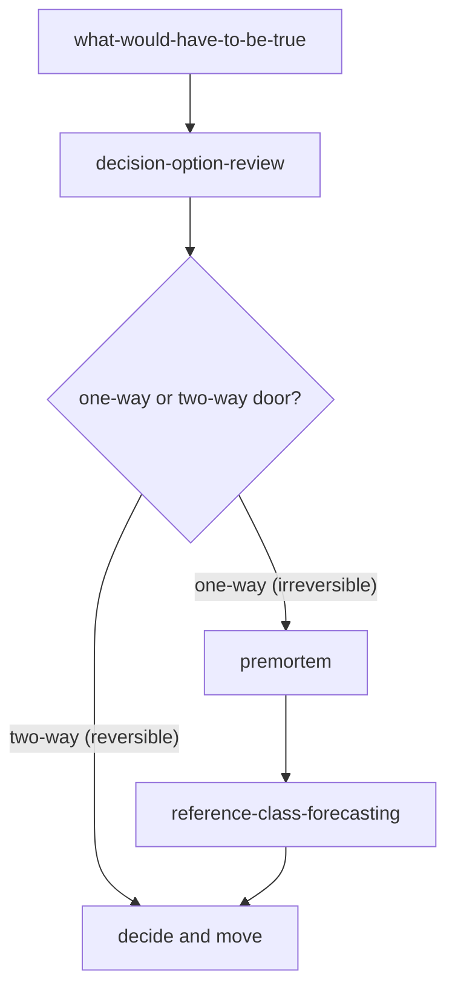

For anyone facing a consequential, hard-to-reverse choice who wants to commit on structure rather than confidence. Bring one real decision: an investment, a hire, a migration, a strategic bet. By the end you will have separated what would have to be true from what is true, compared the live options on explicit criteria, calibrated how much rigor the call deserves, stress-tested the chosen plan, and reality-checked your forecast against how similar bets actually turned out. Each page below is self-contained, so you can follow this with a pen or hand the steps to an agent.

## The path

1. **[What Would Have to Be True](../../frameworks/think-what-would-have-to-be-true/)** - Start here because a hard choice is usually argued as a clash of opinions, where the loudest advocate wins. This move flips the question from "is this a good idea?" to "what would have to be true for this to be the best choice?", then rates each condition's confidence and names the one or two load-bearing, least-certain conditions to test first. The artifact is an **assumption ledger** ending in those killer conditions. It frames what the rest of the path must weigh and reality-check.

2. **[Decision Option Review](../../frameworks/think-decision-option-review/)** - Once you have real options on the table, compare them instead of letting intuition score them on shifting, unstated criteria. Define and weight the criteria that actually matter, score each option, surface what each leading option gives up, and recommend one while flagging where the scoring is soft. The artifact is a **criteria-weighted option matrix**, with the recommendation stating what would flip it. (If only one option is live, skip this and carry the ledger straight into reversibility.) The conditions from the ledger become criteria here.

3. **[One-Way vs Two-Way Door](../../frameworks/think-one-way-vs-two-way-door/)** - Before you spend more deliberation, triage how reversible the recommended choice is. Test reversibility against named dimensions - money, time, trust, legal, foreclosed future options - and match the rigor and sign-off to the verdict. The artifact is a **reversibility classification plus a matched deliberation level**. A two-way door licenses you to decide fast and stop here. A one-way door earns the heavier rigor of the next two steps; it routes the choice forward rather than picking it.

When only one option is live, the Decision Option Review step is skipped - go straight from what-would-have-to-be-true to the reversibility check.

4. **[Premortem](../../frameworks/think-premortem/)** - For a one-way door, stress-test the chosen plan before committing. Assume it is some horizon out and the plan has already failed badly, reason backward to the likely causes, then convert each top cause into a tripwire, a mitigation, an owner, and a kill criterion. The artifact is a ranked **risk register**. The ledger's killer conditions and the matrix's soft scores are prime places failure hides, so feed them in as candidate causes.

5. **[Reference Class Forecasting](../../frameworks/think-reference-class-forecasting/)** - Finally, reality-check the forecast your decision rests on. Replace the inside view built from your own plan's details with the outside view: define a class of genuinely comparable past cases, take the base-rate distribution of how they actually turned out, and anchor the estimate there, adjusting only cautiously for real specifics. The artifact is a **reference-class estimate**, stated as a range. The honest constraint: it needs real base-rate data - inventing a distribution is worse than admitting uncertainty. If no comparable class exists, say so and lean on the premortem instead.

## What you will be able to do

You will have run the full decision-and-risk stack on one real choice: the conditions it depends on made explicit and rated, the options compared on criteria anyone can inspect, the reversibility judged before the deliberation rather than after, the failure modes surfaced as signals and pre-committed responses, and the forecast anchored on how comparable bets actually resolved instead of on optimism. None of these steps promises a better outcome on its own. What the stack gives you is a decision you can defend on its structure: you can show what would have to hold, why this option, how much rigor it warranted, what could break it and what you will do, and what the base rate says you should expect.
