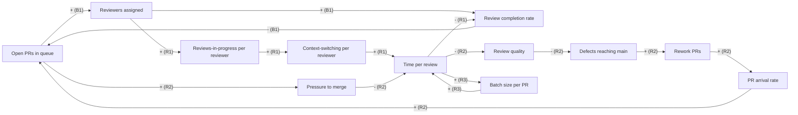

> **Daniel**, senior engineer at a ~200-person company. The decision: stop the code-review backlog from growing instead of throwing more reviewers at it. Prompting style: organized.

This is a complete run, prompt to artifact. Framework: [Causal Loop Diagrams](../../frameworks/think-causal-loop-diagrams/). For the cast and the other journeys, see the [Showcase index](../).

## The situation

The review queue keeps growing no matter how many people Daniel adds to the reviewer rotation. Every time it gets bad, leadership pulls another engineer into reviewing, the backlog dips for a week, then climbs higher than before. He suspects the fix is feeding the problem, so before proposing anything he wants the feedback loops mapped to find what actually drives the backlog.

## The prompt

```
/think-causal-loop-diagrams

Situation: our code-review queue keeps growing. Median time-to-merge has gone
from 1 day to 5 over two quarters. Throughput of merged PRs is flat or down.

What we tried: added reviewers to the rotation three times. Each time the queue
dips for ~1 week then climbs past where it was.

Constraints: ~40 engineers all opening PRs into the same queue. Reviewing is
interrupt-driven - people review between their own coding tasks. No dedicated
review time.

What I notice: the more reviewers we add, the more each one context-switches,
and reviews seem to get slower per-review, not faster.

Map the feedback loops. I want to see why adding reviewers isn't fixing the
backlog before I propose a change.
```

Situation, the metric, what he already tried, the constraints, and the dynamic he suspects. The framework supplies the loop structure and the read.

## The output

> **Signed Causal Loop Diagram - Code-review backlog**

> The team keeps adding reviewers to a growing review queue, and the queue keeps growing. This run closes and signs the loops to see why the obvious fix is not landing, which loop is driving the backlog, and where the real leverage is - framed as an argument from the loop structure, not a forecast.

### Variables in play

- Open PRs in queue (the backlog), PR arrival rate, Review completion rate, Reviewers assigned, Reviews-in-progress per reviewer, Context-switching per reviewer, Time per review, Review quality, Defects reaching main, Rework PRs (fixes + reverts), Pressure to merge, Batch size per PR.

### Closed loops (signed)

| Loop | Link path with polarities | Net sign | Label (R/B) | Delay? | What this loop does |
|---|---|---|---|---|---|
| B1 (the intended fix) | Open PRs in queue -(+)-> Reviewers assigned -(+)-> Review completion rate -(-)-> Open PRs in queue | - (one negative) | B (balancing) | yes (staffing lags the backlog) | counteracts: more reviewers drain the queue. This is the loop leadership keeps pulling - it works briefly, then loses to the reinforcing loops below |
| R1 (thrash) | Reviewers assigned -(+)-> Reviews-in-progress per reviewer -(+)-> Context-switching per reviewer -(+)-> Time per review -(-)-> Review completion rate -(-)-> Open PRs in queue -(+)-> Reviewers assigned | + (two negatives) | R (reinforcing) | no | amplifies: adding reviewers raises everyone's parallel work and context-switching, which slows each review, which keeps the queue high, which pulls in more reviewers. The fix feeds itself |
| R2 (corner-cutting) | Open PRs in queue -(+)-> Pressure to merge -(-)-> Time per review -(-)-> Review quality -(-)-> Defects reaching main -(+)-> Rework PRs -(+)-> PR arrival rate -(+)-> Open PRs in queue | + (four negatives) | R (reinforcing) | yes (defects surface downstream) | amplifies: a long queue pressures fast, shallow reviews, which let defects through, which come back as rework PRs that re-enter the same queue |
| R3 (big-batch) | Open PRs in queue -(+)-> Time per review -(+)-> Batch size per PR -(+)-> Time per review | + (all positive) | R (reinforcing) | no | amplifies: slow reviews make authors hold work and ship larger PRs, and larger PRs take longer to review - slowness breeds bigness breeds slowness |

### Open / linear parts (no loop closed - recorded honestly)

- "Headcount growth -> more engineers -> more PRs opened": real and it raises PR arrival rate, but it is an external driver feeding into the system, not a loop the team closes here. Recorded as an open input, not forced into a cycle.

### Behavior read-out (an argument, not a prediction)

- **Dominant loop right now:** **R1 (thrash)**, reinforced by R2 and R3. B1 - the staffing fix - is real but weak, because each reviewer added also strengthens R1. The structure argues the backlog is no longer a staffing shortfall; it is a self-feeding slowdown that more staffing partly feeds.
- **Resulting dynamic:** **dip-then-overshoot, not a clean drain.** Each time reviewers are added, B1 acts first and the queue dips for about a week; then R1 (more parallel work, more context-switching, slower reviews) and R2/R3 catch up and push the queue past its prior peak. That is exactly the observed pattern, argued from the loop signs rather than fitted to the data.
- **What would flip dominance:** weaken R1 instead of strengthening B1. Anything that cuts **context-switching and parallel reviews-in-progress** - WIP limits on open reviews, dedicated and protected review blocks, a smaller pool of focused reviewers rather than a larger interrupt-driven one - lets each review finish faster and lets B1 win. Cutting **batch size** (smaller PRs) drains R3, and tighter review on the highest-risk changes drains R2 by reducing rework re-entering the queue. Adding more reviewers does none of these; it pulls B1 while feeding R1.
- **Honest scope:** a structured argument about why the queue behaves this way from the loop structure, not a forecast of time-to-merge values or dates. Another engineer might sign or include loops differently (CLD reliability is a known limit); the value here is the explicit, inspectable structure that shows the fix and the failure share the same variable - Reviewers assigned.



## Why this prompt worked

Daniel named the **system and its metric** (queue, time-to-merge), the **fix he already tried** (adding reviewers), and the **dynamic he suspected** (more reviewers -> more context-switching -> slower reviews). That gave the framework the variables to close real loops and the one suspicion to test - and signing the loops confirmed it: the intended fix (B1) and the dominant failure (R1) both run through "Reviewers assigned," which is why adding people dips the queue then makes it worse.

## What happened next

Daniel did not write the "we need more reviewers" proposal he was originally asked for. The diagram reframed the ask: the backlog was a thrash problem, not a staffing one. He proposed a WIP limit on concurrent reviews per person and two protected review blocks a day - moves that weaken R1 - plus a soft cap on PR size to drain R3, and he kept the diagram in the proposal so reviewers could check his loop signs rather than take the conclusion on faith. Next in his thread: with the leverage identified, he needed to compare a few concrete WIP-limit and review-rotation options against each other, so he reached for the [framework advisor](../../tools/think-framework-advisor/) to sequence a decision.
