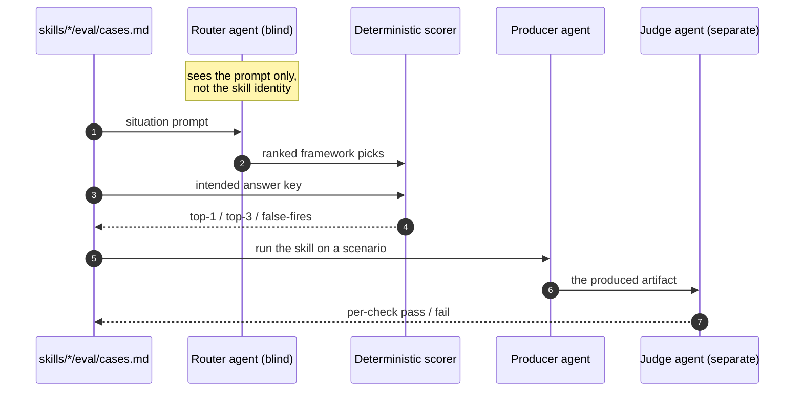

import { Card, CardGrid, Aside, Badge } from '@astrojs/starlight/components';

Most thinking-tool collections ask you to take their value on faith. This library measures two things you can check, and publishes the raw results.

<Aside type="caution" title="The honest frame first">
These are thinking *aids*, not magic. The evidence that any given method improves a real-world decision is graded honestly on every framework page, and is often weaker than the method is usually sold on (see [the evidence model](../evidence-model/)). What the two evals below measure is narrower and more checkable: does the right framework fire for a situation, and does a framework, once run, produce the artifact it promises. They do **not** measure whether the artifact made your decision turn out better.
</Aside>

## The three questions a library like this must answer

<CardGrid>
  <Card title="Does the right tool fire?" icon="random">
    If you describe a situation, does the catalog route you to the framework that actually fits, and stay quiet when no tool fits? This is what the [Framework Advisor](../../tools/think-framework-advisor/) depends on. Measured by the **trigger eval**.
  </Card>
  <Card title="Is the output any good?" icon="document">
    When a framework runs, does it produce a structured artifact that meets its own quality checklist, not a wall of prose? Measured by the **output eval**.
  </Card>
  <Card title="Does the front door get found?" icon="rocket">
    Before any of that: out of every skill an agent has installed, does it reach for *this* library's entry point at all? A catalog that routes perfectly is worthless if nothing ever opens it. Measured by the **skill-selection eval**, which is a different question against a different corpus - and is reported separately below, never blended with the other two.
  </Card>
</CardGrid>

## Trigger eval: the catalog routes cleanly

Every trigger and anti-case from all **63 skills'** own `eval/cases.md` was pooled into one blind answer key. Blind router agents - which never see which skill authored a case or the expected answer - routed each situation against the public advisor catalog, exactly as the live advisor does. A deterministic scorer graded routed-versus-expected.

<CardGrid>
  <Card title="0 false-fires" icon="approve-check">
    Across **379 anti-cases** (deliberately wrong-tool or no-tool situations), no skill wrongly grabbed one. **100%.** This is the metric that matters most: skills that do not over-trigger.
  </Card>
  <Card title="100% top-1, 100% top-3" icon="approve-check">
    Of **376 "should fire" situations**, all 376 routed to the intended framework on the first pick - on 2026-09-10, and again on 2026-09-13. The earlier run scored 373 of 376; the three misses were near-twins that still carried the intended skill in the top 3. Treat the difference as run-to-run variance, not progress - see below.
  </Card>
</CardGrid>

The headline: **755 cases, zero false-fires, 100% top-1 routing** across all 63 skills. The catalog discriminates - the descriptions and anti-triggers send a situation to the right framework.

**This run is a reproduction, and that is the point of showing it.** The trigger eval was re-run on 2026-09-10 against a byte-identical catalog and case set - the routing corpus has not changed since 2026-06-19 - so nothing about the library moved between the two runs. What changed: top-1 went 373/376 to 376/376, and right-alternative went 123/128 to 122/128. That is **run-to-run variance in a model-executed measurement**, not the catalog improving, and reading it as improvement would be a mistake. The number that matters held exactly: **zero false-fires, both times.**

## Output eval: the artifacts hit their own bar

A separate measurement. For each of the **63 skills**, a producer agent runs it on a real prompt and emits the full artifact; a *separate* judge agent grades that artifact against the skill's own "output checks," check by check, so nothing grades itself. Here is how the blind eval harness routes and scores:

<CardGrid>
  <Card title="424 of 429 checks passed" icon="approve-check">
    **98.8%** of individual output checks passed across freshly produced artifacts, re-measured **2026-09-12**. **58 of 63** skills satisfied every single check. The previous run scored 428 of 429 with 62 of 63 perfect - so this is **lower**, and the next card is about why that is not a story of decline.
  </Card>
  <Card title="The number went down because the judge got stricter" icon="information">
    Two things changed since the earlier run: the skills themselves moved across three releases, **and** the grader was rewritten to stop taking artifacts at their word. It now opens the file behind any claim an artifact makes about another skill and fails the check if the claim is false. Neither cause can be separated from the other, so this is a **re-measurement under a stricter instrument**, not the same measurement repeated.
  </Card>
</CardGrid>

**What the stricter judge actually caught, since that is the useful part.** One of the five failures is a defect the old grader could not have seen: `think-qualitative-comparative-analysis` sent a one-case job away with the claim that process tracing "is a method, not a shipped skill here; run it by hand" - and `think-process-tracing` ships, at tier P. A confident sentence about another skill is indistinguishable from a true one unless you go and look. It is fixed now; it had been wrong for three months, and no number caught it before.

The other four are equally specific rather than vague: an affinity-mapping artifact that narrates clustering-before-naming while its own appendix shows items grouped in contiguous theme blocks; a negotiation map with a section headed "this map will not emit one" that then emits exactly that; a calibration scorecard leaving two of four required recordings blank by its own admission; and a pyramid-principle argument that fails exhaustiveness on the very question the claim turns on.

**A higher number under a blinder grader would be worth less.** That is the whole reason to re-run against a stricter one and publish what comes back.

## Skill-selection eval: does the front door get found?

The two evals above both assume you have already arrived. They ask *which framework fits* and *is the artifact good* - and both route against the advisor's catalog of 63 frameworks. Neither can tell you whether an agent with 77 tools installed reaches for this library in the first place.

That took a different instrument, because the first one was structurally blind to it: the framework catalog contains no meta-skills (correctly - it is the advisor's list of things to *recommend*), so a router reading it can never return `think-framework-advisor` as a pick. The four entry-point tools were not failing that eval. They were invisible to it.

<Aside type="caution" title="Read this number separately from the two above">
This eval routes against the **installed roster** - 67 skills plus 10 commands, each reduced to the name and description an agent actually sees - not against the enriched 63-framework catalog. Different corpus, different question, different case count. The figures are **not comparable** with the trigger eval's and are deliberately not combined into a single headline.
</Aside>

<CardGrid>
  <Card title="16 of 17 for the front door" icon="approve-check">
    Across the four entry-point tools' own trigger cases, **16 of 17** routed to the intended tool on the first pick (**94.1%**), with **zero false fires** among them. The single miss is one advisor case - *"Should we launch a free tier? I'm nervous we're committing because it's the obvious move"* - which reads to a router as a decision to pressure-test rather than a request for routing. A defensible miss, and still a miss.
  </Card>
  <Card title="One false fire across the whole roster" icon="warning">
    Over all **794 cases**: **392 of 393** top-1 (99.7%), and **399 of 400** anti-cases drew no false fire - which is **not** a clean sweep. `think-pairwise-comparison` grabbed *"I have twenty candidates to rank by forced pairwise comparison"*, an anti-case whose own prompt names the tool. Debatable on the merits; counted anyway.
  </Card>
</CardGrid>

**Why that second card exists.** The trigger eval's zero-false-fire result is real and holds at 379 of 379. It would be easy to let that number stand for the whole library and leave this one out. But the two evals ask different questions of different corpora, and on *this* corpus the answer is 399 of 400, not 400 of 400. Quoting only the friendlier figure is the exact move a page like this exists not to make.

**Read the last digit as noise, because we measured how much noise there is.** This exact measurement - same 794 prompts, same roster, same model - has now been run three times: once on 2026-09-10 and twice on 2026-09-13. Top-1 came back **391, 392, 392**. On the two runs where *nothing whatsoever changed between them*, **15 of the 794 picks still disagreed**, one of them flipping from wrong to right.

So this instrument reproduces to within about one case, and the final digit of that percentage is not a fact about the library. Earlier versions of this page published a single run's figure with no indication of that, which invited exactly the kind of trend-reading the number cannot support.

What does **not** move across all three runs: **399 of 400** on the anti-cases, **one** false fire, and the *same* false fire each time. The front-door figure does not move either - **16 of 17** with zero false fires, three times identically. Those are the figures to hold this library to. A one-case difference in the top-1 count is not evidence of anything.

**The added commands did not steal selections.** v0.14.0 shipped nine always-loaded recipe commands, which raised a fair worry that more description surface would degrade routing. In this corpus they compete directly against all 67 skills: across 794 cases, commands took the top pick **twice** (0.25%), and appeared somewhere in the top 3 84 times. Visible to a router, and simply not winning.

**All four entry-point tools now have both halves measured.** Their artifacts were graded too: the three that a generic produce-then-judge harness can measure scored **20 of 20** checks (2026-09-11), and the fourth - the research engine, which dispatches to a subagent and whose own instructions forbid running research inline - needed a purpose-built dispatch harness and scored **6 of 6**, one of those decided by running a schema validator rather than by a model judge.

**What it does not prove.** Seventeen trigger cases is a small N, and they are self-authored. It is a first baseline for a question that had no instrument at all until 2026-09-10, not a settled property. It has now held identically across three runs on one model, which rules out *this instrument's* day-to-day variance as the explanation but says nothing about a different model or a wider case set.

## The 7 contested lenses are folded into these numbers

The catalog is **63 skills total: 56 evidence-graded core skills + 7 contested lenses**. The contested lenses are famous frameworks with weak or mixed empirical evidence (SWOT, Five Whys, and similar), added in v0.11.0 and shipped caveat-first as explicit-request-only skills. Earlier runs scored them as a separate cohort; every run since 2026-06-25, including the 2026-09-12 one above, pools all 63 skills into one answer key, so the numbers above already include them.

<CardGrid>
  <Card title="They never grab a generic prompt" icon="approve-check">
    The zero-false-fire result above includes the contested lenses: not one grabbed a generic situation. That is exactly how explicit-request-only is meant to behave - a contested lens fires only when the user names it directly, and routes elsewhere otherwise.
  </Card>
  <Card title="Their caveats hold under the judge" icon="approve-check">
    Each contested lens still leads with its caveat-first contract before running the framework, and its artifact passed the same blind judge as every core skill. Weak method evidence (graded honestly per page) is a separate axis from whether the skill routes and produces cleanly.
  </Card>
</CardGrid>

A behavioral score is not an evidence claim. A contested lens can route correctly and produce a clean caveat-first artifact while its underlying method evidence stays weak. For evidence grading, the **56 core skills remain the baseline** and the contested lenses are graded low on their own pages; the unified run above measures only routing and artifact quality across the whole catalog. See [the evidence model](../evidence-model/) and each dossier for the method grade.

## What this does **not** prove

<Aside type="note" title="The limits, stated plainly">
- The evals measure **routing** and **artifact quality**, not real-world **decision outcomes**. A premortem that surfaces five sharp risks is a good artifact; whether it made your launch succeed is a different, harder question the dossiers are honest about.
- They are **model-executed and non-deterministic** - a snapshot, not a fixed property. One skill failed a check in a pilot and passed it in the full run. They are a measurement, not a gate.
- **The evals carry different dates and are not blended.** Framework routing was re-run **2026-09-13** (755 cases), returning the same headline figures as 2026-09-10 - 376 of 376 top-1 and zero false fires; skill selection was re-run **2026-09-13** against a different corpus (794 cases); the meta-skills' artifacts were re-graded **2026-09-11**; all 63 skills' artifacts were re-graded **2026-09-12** (429 checks). Each is reported under its own date and corpus above, and none is combined with another into a single headline. These superseded the earlier split cohorts (56 core skills 2026-06-17, 7 contested lenses 2026-06-19).
- **The output figure is not comparable with the run before it, and we say so rather than charting a trend.** 428/429 (2026-06-25) and 424/429 (2026-09-12) were produced by *different graders* as well as against different skills. Two moving variables means the difference is not attributable, in either direction. Anyone drawing a line between those two points is reading noise and an instrument change as a trend.
- **The earlier runs did not record which model produced them**, so the 2026-09-10 trigger figures are a reproduction of the *measurement*, not a controlled comparison against a known baseline model. Recording the model and fingerprinting the case set on every run is open work; this run records its model, the ones before it did not.
</Aside>

## Check it yourself

<CardGrid>
  <Card title="The methodology" icon="open-book">
    How the blind routers, answer keys, and scorers work is documented in the harness ([`scripts/eval/`](https://github.com/product-on-purpose/thinking-framework-skills/tree/main/scripts/eval)). It runs without an API key and is reproducible.
  </Card>
  <Card title="The raw results" icon="document">
    The full per-skill scorecards and machine records live in the repo ([`docs/internal/eval-results/`](https://github.com/product-on-purpose/thinking-framework-skills/tree/main/docs/internal/eval-results)) - every number above traces to a scorecard file you can audit.
  </Card>
  <Card title="The evidence behind each method" icon="approve-check">
    Separately from behavior, every framework carries a graded dossier. Trace any claim to its source in [the bibliography](../../evidence/bibliography/).
  </Card>
  <Card title="How a page is built" icon="setting">
    The pages are generated from the skills, so the docs cannot drift from what runs. See [how to read a page](../how-to-read-a-page/).
  </Card>
</CardGrid>
