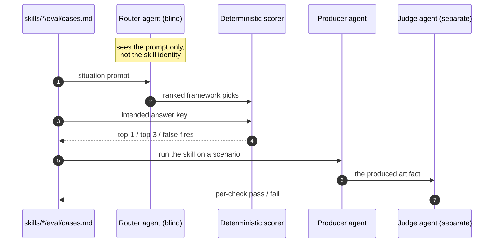

import { Card, CardGrid, Aside, Badge } from '@astrojs/starlight/components';

Most thinking-tool collections ask you to take their value on faith. This library measures two things you can check, and publishes the raw results.

<Aside type="caution" title="The honest frame first">
These are thinking *aids*, not magic. The evidence that any given method improves a real-world decision is graded honestly on every framework page, and is often weaker than the method is usually sold on (see [the evidence model](../evidence-model/)). What the two evals below measure is narrower and more checkable: does the right framework fire for a situation, and does a framework, once run, produce the artifact it promises. They do **not** measure whether the artifact made your decision turn out better.
</Aside>

## The two questions a library like this must answer

<CardGrid>
  <Card title="Does the right tool fire?" icon="random">
    If you describe a situation, does the catalog route you to the framework that actually fits, and stay quiet when no tool fits? This is what the [Framework Advisor](../../tools/think-framework-advisor/) depends on. Measured by the **trigger eval**.
  </Card>
  <Card title="Is the output any good?" icon="document">
    When a framework runs, does it produce a structured artifact that meets its own quality checklist, not a wall of prose? Measured by the **output eval**.
  </Card>
</CardGrid>

## Trigger eval: the catalog routes cleanly

Every trigger and anti-case from all **63 skills'** own `eval/cases.md` was pooled into one blind answer key. Blind router agents - which never see which skill authored a case or the expected answer - routed each situation against the public advisor catalog, exactly as the live advisor does. A deterministic scorer graded routed-versus-expected.

<CardGrid>
  <Card title="0 false-fires" icon="approve-check">
    Across **379 anti-cases** (deliberately wrong-tool or no-tool situations), no skill wrongly grabbed one. **100%.** This is the metric that matters most: skills that do not over-trigger.
  </Card>
  <Card title="99% top-1, 100% top-3" icon="approve-check">
    Of **376 "should fire" situations**, 373 routed to the intended framework on the first pick; all 376 had it in the top 3. The 3 first-pick misses are near-twins, each with the intended skill still in the top 3.
  </Card>
</CardGrid>

The headline: **755 cases, zero false-fires, 99% top-1 routing** across all 63 skills. The catalog discriminates - the descriptions and anti-triggers send a situation to the right framework.

## Output eval: the artifacts hit their own bar

A separate measurement. For each of the **63 skills**, a producer agent runs it on a real prompt and emits the full artifact; a *separate* judge agent grades that artifact against the skill's own "output checks," check by check, so nothing grades itself. Here is how the blind eval harness routes and scores:

<CardGrid>
  <Card title="100% of checks passed" icon="approve-check">
    **428 of 429** individual output checks passed across freshly produced artifacts. **62 of 63** skills satisfied every single check.
  </Card>
  <Card title="The miss was specific" icon="information">
    The single miss was specific: one skill asserted tentativeness about its own output but dropped the method-level evidence caveat (that its grounding is conceptual and transferred, not directly tested). A precise, fixable gap, not a vague score. The eval is non-deterministic, so the exact skill varies run to run, but the pattern - the evidence caveat is the single easiest element to drop - is stable.
  </Card>
</CardGrid>

## The 7 contested lenses are folded into these numbers

The catalog is **63 skills total: 56 evidence-graded core skills + 7 contested lenses**. The contested lenses are famous frameworks with weak or mixed empirical evidence (SWOT, Five Whys, and similar), added in v0.11.0 and shipped caveat-first as explicit-request-only skills. Earlier runs scored them as a separate cohort; this 2026-06-25 run pools all 63 skills into one answer key, so the numbers above already include them.

<CardGrid>
  <Card title="They never grab a generic prompt" icon="approve-check">
    The zero-false-fire result above includes the contested lenses: not one grabbed a generic situation. That is exactly how explicit-request-only is meant to behave - a contested lens fires only when the user names it directly, and routes elsewhere otherwise.
  </Card>
  <Card title="Their caveats hold under the judge" icon="approve-check">
    Each contested lens still leads with its caveat-first contract before running the framework, and its artifact passed the same blind judge as every core skill. Weak method evidence (graded honestly per page) is a separate axis from whether the skill routes and produces cleanly.
  </Card>
</CardGrid>

A behavioral score is not an evidence claim. A contested lens can route correctly and produce a clean caveat-first artifact while its underlying method evidence stays weak. For evidence grading, the **56 core skills remain the baseline** and the contested lenses are graded low on their own pages; the unified run above measures only routing and artifact quality across the whole catalog. See [the evidence model](../evidence-model/) and each dossier for the method grade.

## What this does **not** prove

<Aside type="note" title="The limits, stated plainly">
- The evals measure **routing** and **artifact quality**, not real-world **decision outcomes**. A premortem that surfaces five sharp risks is a good artifact; whether it made your launch succeed is a different, harder question the dossiers are honest about.
- They are **model-executed and non-deterministic** - a snapshot, not a fixed property. One skill failed a check in a pilot and passed it in the full run. They are a measurement, not a gate.
- This unified run across all 63 skills was measured **2026-06-25** (755 routing cases, 429 output checks). Re-running after each catalog change keeps these numbers live rather than frozen; the previous runs scored the 56 core skills (2026-06-17) and the 7 contested lenses (2026-06-19) as separate cohorts, now superseded by this single pass.
</Aside>

## Check it yourself

<CardGrid>
  <Card title="The methodology" icon="open-book">
    How the blind routers, answer keys, and scorers work is documented in the harness ([`scripts/eval/`](https://github.com/product-on-purpose/thinking-framework-skills/tree/main/scripts/eval)). It runs without an API key and is reproducible.
  </Card>
  <Card title="The raw results" icon="document">
    The full per-skill scorecards and machine records live in the repo ([`docs/internal/eval-results/`](https://github.com/product-on-purpose/thinking-framework-skills/tree/main/docs/internal/eval-results)) - every number above traces to a scorecard file you can audit.
  </Card>
  <Card title="The evidence behind each method" icon="approve-check">
    Separately from behavior, every framework carries a graded dossier. Trace any claim to its source in [the bibliography](../../evidence/bibliography/).
  </Card>
  <Card title="How a page is built" icon="setting">
    The pages are generated from the skills, so the docs cannot drift from what runs. See [how to read a page](../how-to-read-a-page/).
  </Card>
</CardGrid>
