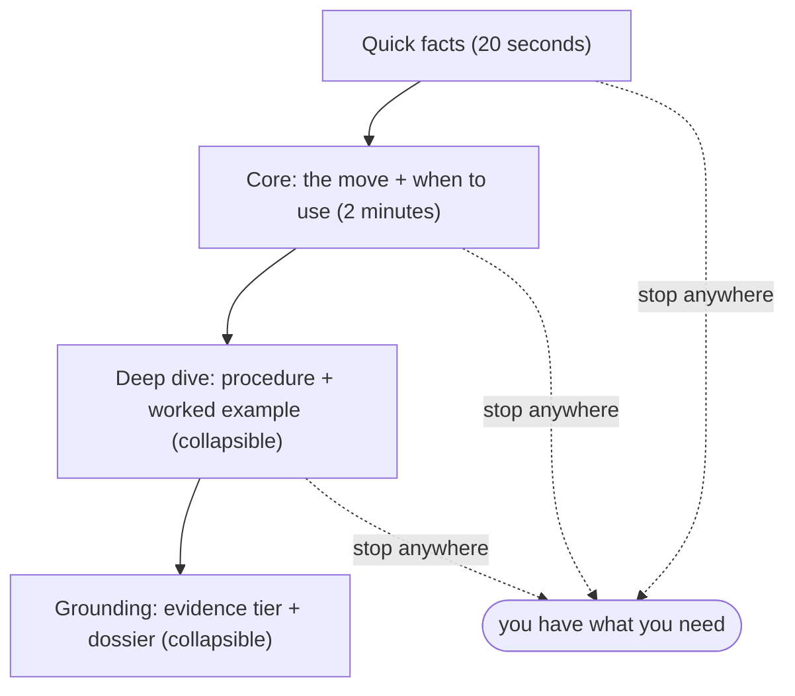

import { Steps, Card, CardGrid, Aside, Badge } from '@astrojs/starlight/components';

Every framework page uses the same four layers. Read as deep as you need and stop.

<Steps>

1. **Quick facts** <Badge text="20 sec" variant="tip" /> - a card at the top: the mechanism in one line, the artifact it produces, its evidence tier, its domain, and when to use it (and when not). Enough to decide whether this is your tool.

2. **The core** <Badge text="2 min" /> - the mechanism explained, the numbered procedure, the output format, and an explicit "when NOT to use this". Everything you need to run it.

3. **Deep dive** <Badge text="collapsible" variant="note" /> - a fully worked example on the shared Northwind scenario (a B2B SaaS weighing a free-tier launch), so you see the artifact at quality.

4. **Grounding** <Badge text="collapsible" variant="note" /> - the full evidence dossier: what the research does and does not show, the transferred-evidence flag, the honest caveats, and the graded source list.

</Steps>

The four layers build on each other - stop when you have what you need:

<Aside type="tip" title="Pick your depth">
Beginners stop after layer 2. Skeptics and advanced readers open the collapsible deep-dive and grounding sections.
</Aside>

## Three honesty cues to notice

<CardGrid>
  <Card title="The tier badge" icon="approve-check">
    S/M/P/V/A/C/X tells you how strong the evidence is. See [the evidence model](../evidence-model/).
  </Card>
  <Card title="When NOT to use this" icon="warning">
    On every page on purpose. A framework applied to the wrong situation is worse than none.
  </Card>
  <Card title="What this does NOT show" icon="information">
    The dossier keeps the page from overselling. If a page makes a quantified claim, the source for it is in the grounding.
  </Card>
</CardGrid>

<Aside type="note" title="Pages are generated from the skills">
Each framework page is a generated view of the skill's own files (`SKILL.md`, the dossier, the worked example). The skill is the source of truth; the page renders it, so the two can never drift.
</Aside>
