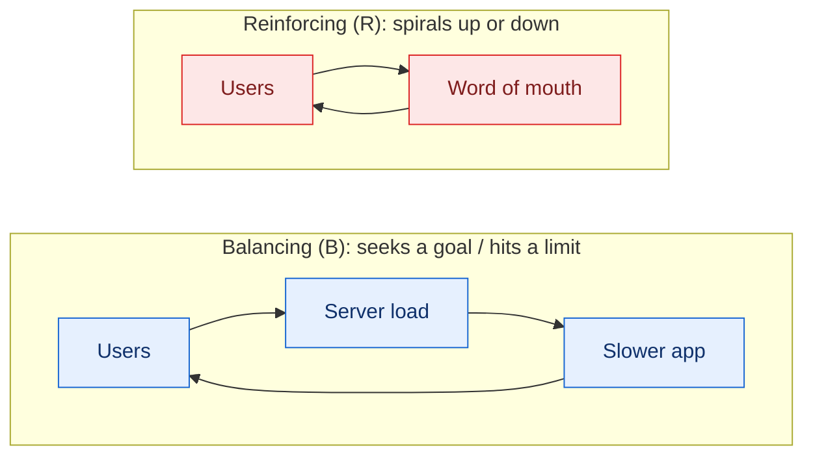

<!-- thinking-framework-skills | concept diagram (rendered on the site, not agent-facing) -->
## Picture it

Every causal loop diagram is built from two kinds of closed loop. A reinforcing loop (R) feeds on itself and accelerates; a balancing loop (B) pushes back toward a goal or limit.

*Sign each link, close the loop, and label it R or B. Which loop dominates tells you whether the system spirals, settles toward a goal, or oscillates.*
