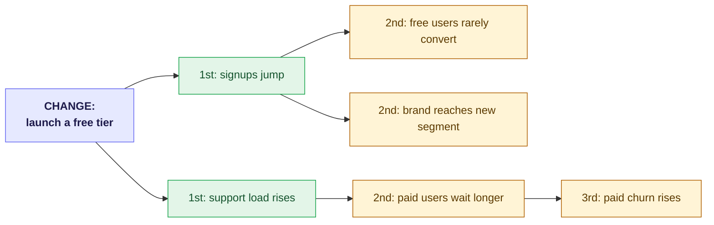

<!-- thinking-framework-skills | concept diagram (rendered on the site, not agent-facing) -->
## Picture it

Put the change in the center, then radiate outward: direct first-order effects, then the effects of those effects, and so on. The surprises usually live in the second and third ring.

*The first ring is obvious; the value is following the chain to the non-obvious second- and third-order consequences.*
