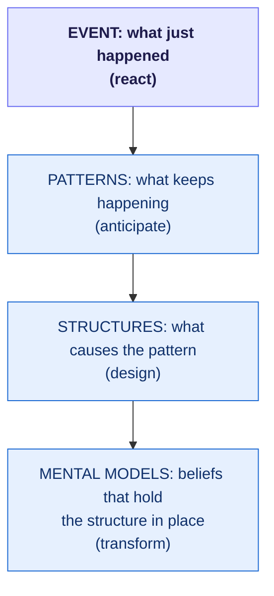

<!-- thinking-framework-skills | concept diagram (rendered on the site, not agent-facing) -->
## Picture it

The event you reacted to is the tip. Most of the leverage is below the waterline, in the patterns, structures, and beliefs that keep producing events like it.

*Acting only on the event treats the symptom. Each level down is harder to change and higher in leverage.*
