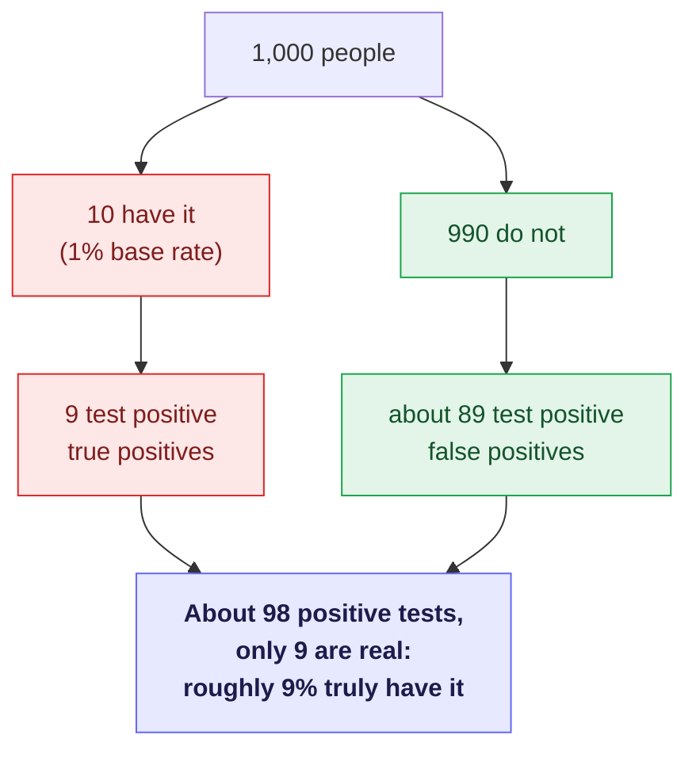

<!-- thinking-framework-skills | concept diagram (rendered on the site, not agent-facing) -->
## Picture it

A conditional probability that feels impossible as a percentage becomes obvious once you count people. Imagine 1,000 people, a condition that affects 1%, and a test that is roughly 90% accurate:

*Illustrative numbers. The point is the move: stated as natural frequencies (9 of 98), the base-rate trap that "a positive test means I probably have it" is visibly wrong.*
