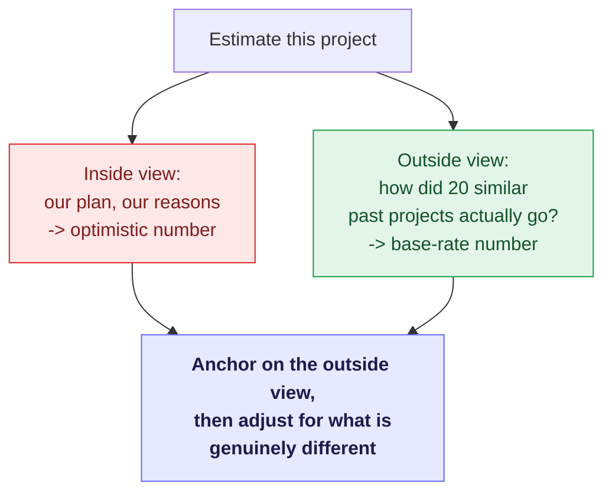

<!-- thinking-framework-skills | concept diagram (rendered on the site, not agent-facing) -->
## Picture it

Every estimate can be made two ways. The inside view runs on your plan and your reasons, and tends to run late. The outside view asks how comparable past efforts actually went.

*The correction is to start from the track record of the reference class, not from the inside-view story, then adjust.*
