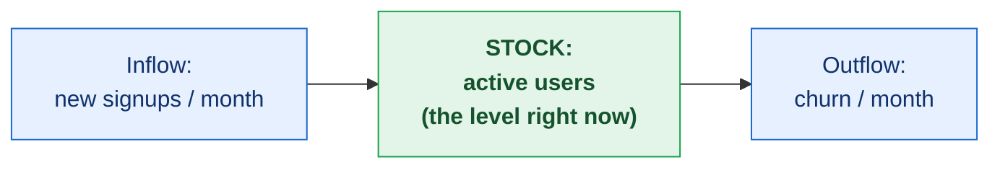

<!-- thinking-framework-skills | concept diagram (rendered on the site, not agent-facing) -->
## Picture it

A stock is a level that accumulates (like water in a bathtub); flows are the rates that fill or drain it. The level changes only by the net of the flows, which is why people misjudge it.

*Cutting churn (the outflow) raises the level even with signups flat; a big inflow still shrinks the stock if the outflow is bigger. Reason about the level and the two rates separately.*
